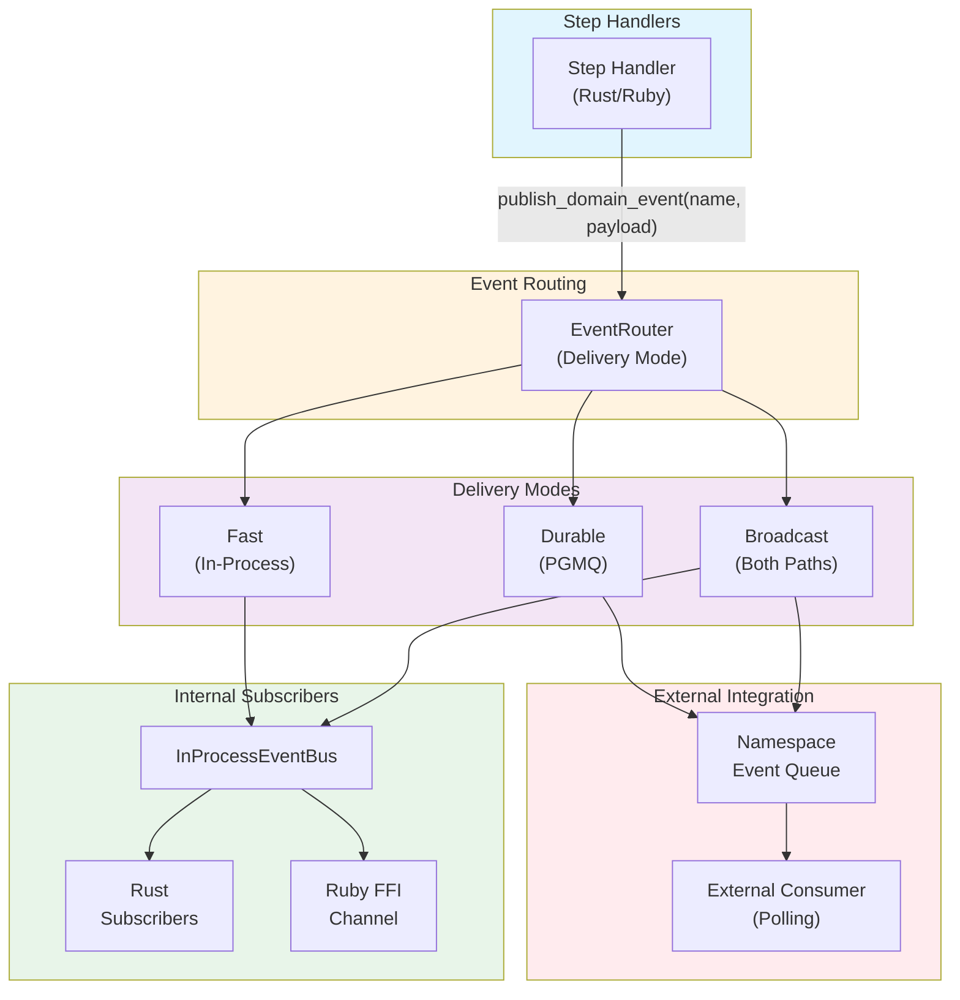

# Domain Events Architecture

**Last Updated**: 2025-12-01
**Audience**: Architects, Developers
**Status**: Active (TAS-65 Complete)
**Related Docs**: [Documentation Hub](README.md) | [Events and Commands](events-and-commands.md) | [Observability](observability/README.md) | [States and Lifecycles](states-and-lifecycles.md)

← Back to [Documentation Hub](README.md)

---

This document provides comprehensive documentation of the domain event system in tasker-core, covering event delivery modes, publisher patterns, subscriber implementations, and integration with the workflow orchestration system.

## Overview

### Domain Events vs System Events

The tasker-core system distinguishes between two types of events:

| Aspect | System Events | Domain Events |
|--------|---------------|---------------|
| **Purpose** | Internal coordination | Business observability |
| **Producers** | Orchestration components | Step handlers during execution |
| **Consumers** | Event systems, command processors | External systems, analytics, audit |
| **Delivery** | PGMQ + LISTEN/NOTIFY | Configurable (Durable/Fast/Broadcast) |
| **Semantics** | At-least-once | Fire-and-forget (best effort) |

**System events** handle internal workflow coordination: task initialization, step enqueueing, result processing, and finalization. These are documented in [Events and Commands](events-and-commands.md).

**Domain events** enable business observability: payment processed, order fulfilled, inventory updated. Step handlers publish these events to enable external systems to react to business outcomes.

### Key Design Principle: Non-Blocking Publication

**Domain event publishing never fails the step.** This is a fundamental design decision:

- Event publish errors are logged with `warn!` level
- Step execution continues regardless of publish outcome
- Business logic success is independent of event delivery
- A handler that successfully processes a payment should not fail if event publishing fails

```rust
// Event publishing is fire-and-forget
if let Err(e) = publisher.publish_event(event_name, payload, metadata).await {
    warn!(
        handler = self.handler_name(),
        event_name = event_name,
        error = %e,
        "Failed to publish domain event - step will continue"
    );
}
// Step continues regardless of publish result
```

## Architecture

### Data Flow



### Component Summary

| Component | Purpose | Location |
|-----------|---------|----------|
| `EventRouter` | Routes events based on delivery mode | `tasker-shared/src/events/domain_events/router.rs` |
| `DomainEventPublisher` | Durable PGMQ-based publishing | `tasker-shared/src/events/domain_events/publisher.rs` |
| `InProcessEventBus` | Fast in-memory event dispatch | `tasker-shared/src/events/domain_events/in_process_bus.rs` |
| `EventRegistry` | Pattern-based subscriber registration | `tasker-shared/src/events/domain_events/registry.rs` |
| `StepEventPublisher` | Handler callback trait | `tasker-shared/src/events/domain_events/step_event_publisher.rs` |
| `GenericStepEventPublisher` | Default publisher implementation | `tasker-shared/src/events/domain_events/generic_publisher.rs` |

## Delivery Modes

### Overview

The domain event system supports three delivery modes, configured per event in YAML templates:

| Mode | Durability | Latency | Use Case |
|------|------------|---------|----------|
| **Durable** | High (PGMQ) | Higher (~5-10ms) | External system integration, audit trails |
| **Fast** | Low (memory) | Lowest (<1ms) | Internal subscribers, metrics, real-time processing |
| **Broadcast** | High + Low | Both paths | Events needing both internal and external delivery |

### Durable Mode (PGMQ) - External Integration Boundary

Durable events define the **integration boundary** between Tasker and external systems. Events are published to namespace-specific PGMQ queues where **external consumers** can poll and process them.

**Key Design Decision**: Tasker does NOT consume durable events internally. PGMQ serves as a lightweight, PostgreSQL-native alternative to external message brokers (Kafka, AWS SNS/SQS, RabbitMQ). External systems or middleware proxies can:
- Poll PGMQ queues directly
- Forward events to Kafka, SNS/SQS, or other messaging systems
- Implement custom event processing pipelines

```
payment.processed → payments_domain_events (PGMQ queue) → External Systems
order.fulfilled   → fulfillment_domain_events (PGMQ queue) → External Systems
```

**Characteristics**:
- Persisted in PostgreSQL (survives restarts)
- For external consumer integration only
- No internal Tasker polling or subscription
- Consumer acknowledgment and retry handled by external consumers
- Ordered within namespace

**Implementation**:
```rust
// DomainEventPublisher routes durable events to PGMQ
pub async fn publish_event(
    &self,
    event_name: &str,
    payload: Value,
    metadata: EventMetadata,
) -> TaskerResult<()> {
    let queue_name = format!("{}_domain_events", metadata.namespace);
    let message = DomainEventMessage {
        event_name: event_name.to_string(),
        payload,
        metadata,
    };

    self.message_client
        .send_message(&queue_name, &message)
        .await
}
```

### Fast Mode (In-Process) - Internal Subscriber Pattern

Fast events are the **only delivery mode with internal subscriber support**. Events are dispatched immediately to in-memory subscribers within the Tasker worker process.

```rust
// InProcessEventBus provides dual-path delivery
pub struct InProcessEventBus {
    event_sender: tokio::sync::broadcast::Sender<DomainEvent>,
    ffi_event_sender: Option<mpsc::Sender<DomainEvent>>,
}
```

**Characteristics**:
- Zero persistence overhead
- Sub-millisecond latency
- Lost on service restart
- Internal to Tasker process only
- Dual-path: Rust subscribers + Ruby FFI channel
- Non-blocking broadcast semantics

**Dual-Path Architecture**:
```
InProcessEventBus
       │
       ├──► tokio::broadcast::Sender ──► Rust Subscribers (EventRegistry)
       │
       └──► mpsc::Sender ──► Ruby FFI Channel ──► Ruby Event Handlers
```

**Use Cases**:
- Real-time metrics collection
- Internal logging and telemetry
- Secondary actions that are not business-critical parts of the Task -> WorkflowStep DAG hierarchy
- Example: DataDog, Sentry, NewRelic, PagerDuty, Salesforce, Slack, Zapier

### Broadcast Mode - Internal + External Delivery

Broadcast mode delivers events to **both paths simultaneously**: the fast in-process bus for internal subscribers AND the durable PGMQ queue for external systems. This ensures internal subscribers receive the **same event shape** as external consumers.

```rust
// EventRouter handles broadcast semantics
async fn route_event(&self, event: DomainEvent, mode: EventDeliveryMode) {
    match mode {
        EventDeliveryMode::Durable => {
            self.durable_publisher.publish(event).await;
        }
        EventDeliveryMode::Fast => {
            self.in_process_bus.publish(event).await;
        }
        EventDeliveryMode::Broadcast => {
            // Send to both paths concurrently
            let (durable, fast) = tokio::join!(
                self.durable_publisher.publish(event.clone()),
                self.in_process_bus.publish(event)
            );
            // Log errors but don't fail
        }
    }
}
```

**When to Use Broadcast**:
- Internal subscribers need the same event that external systems receive
- Real-time internal metrics tracking for events also exported externally
- Audit logging both internally and to external compliance systems

**Important**: Data published via broadcast goes to BOTH the internal process AND the public PGMQ boundary. Do not use broadcast for sensitive internal-only data (use `fast` for those).

## Publisher Patterns

### Default Publisher (GenericStepEventPublisher)

The default publisher automatically handles event publication for step handlers:

```rust
pub struct GenericStepEventPublisher {
    router: Arc<EventRouter>,
    default_delivery_mode: EventDeliveryMode,
}

impl GenericStepEventPublisher {
    /// Publish event with metadata extracted from step context
    pub async fn publish(
        &self,
        step_data: &TaskSequenceStep,
        event_name: &str,
        payload: Value,
    ) -> TaskerResult<()> {
        let metadata = EventMetadata {
            task_uuid: step_data.task.task.task_uuid,
            step_uuid: Some(step_data.workflow_step.workflow_step_uuid),
            step_name: Some(step_data.workflow_step.name.clone()),
            namespace: step_data.task.namespace_name.clone(),
            correlation_id: step_data.task.task.correlation_id,
            fired_at: Utc::now(),
            fired_by: "generic_publisher".to_string(),
        };

        self.router.route_event(event_name, payload, metadata).await
    }
}
```

### Custom Publishers

Custom publishers extend `TaskerCore::DomainEvents::BasePublisher` (Ruby) to provide specialized event handling with payload transformation, conditional publishing, and lifecycle hooks.

**Real Example: PaymentEventPublisher** (`workers/ruby/spec/handlers/examples/domain_events/publishers/payment_event_publisher.rb`):

```ruby
# Custom publisher for payment-related domain events
# Demonstrates durable delivery mode with custom payload enrichment
module DomainEvents
  module Publishers
    class PaymentEventPublisher < TaskerCore::DomainEvents::BasePublisher
      # Must match the `publisher:` field in YAML
      def name
        'DomainEvents::Publishers::PaymentEventPublisher'
      end

      # Transform step result into payment event payload
      def transform_payload(step_result, event_declaration, step_context = nil)
        result = step_result[:result] || {}
        event_name = event_declaration[:name]

        if step_result[:success] && event_name&.include?('processed')
          build_success_payload(result, step_result, step_context)
        elsif !step_result[:success] && event_name&.include?('failed')
          build_failure_payload(result, step_result, step_context)
        else
          result
        end
      end

      # Determine if this event should be published
      def should_publish?(step_result, event_declaration, step_context = nil)
        result = step_result[:result] || {}
        event_name = event_declaration[:name]

        # For success events, verify we have transaction data
        if event_name&.include?('processed')
          return step_result[:success] && result[:transaction_id].present?
        end

        # For failure events, verify we have error info
        if event_name&.include?('failed')
          metadata = step_result[:metadata] || {}
          return !step_result[:success] && metadata[:error_code].present?
        end

        true  # Default: always publish
      end

      # Add execution metrics to event metadata
      def additional_metadata(step_result, event_declaration, step_context = nil)
        metadata = step_result[:metadata] || {}
        {
          execution_time_ms: metadata[:execution_time_ms],
          publisher_type: 'custom',
          publisher_name: name,
          payment_provider: metadata[:payment_provider]
        }
      end

      private

      def build_success_payload(result, step_result, step_context)
        {
          transaction_id: result[:transaction_id],
          amount: result[:amount],
          currency: result[:currency] || 'USD',
          payment_method: result[:payment_method] || 'credit_card',
          processed_at: result[:processed_at] || Time.now.iso8601,
          delivery_mode: 'durable',
          publisher: name
        }
      end
    end
  end
end
```

**YAML Configuration for Custom Publisher**:
```yaml
steps:
  - name: process_payment
    publishes_events:
      - name: payment.processed
        condition: success
        delivery_mode: durable
        publisher: DomainEvents::Publishers::PaymentEventPublisher
      - name: payment.failed
        condition: failure
        delivery_mode: durable
        publisher: DomainEvents::Publishers::PaymentEventPublisher
```

### YAML Event Declaration

Events are declared in task template YAML files using the `publishes_events` field at the step level:

```yaml
# config/tasks/payments/credit_card_payment/1.0.0.yaml
name: credit_card_payment
namespace_name: payments
version: 1.0.0
description: Process credit card payments with validation and fraud detection

# Task-level domain events (optional)
domain_events: []

steps:
  - name: process_payment
    description: Process the payment transaction
    handler:
      callable: PaymentProcessing::StepHandler::ProcessPaymentHandler
      initialization:
        gateway_url: "${PAYMENT_GATEWAY_URL}"
    dependencies:
      - validate_payment
    retry:
      retryable: true
      limit: 3
      backoff: exponential
    timeout_seconds: 120

    # Step-level event declarations
    publishes_events:
      - name: payment.processed
        description: "Payment successfully processed"
        condition: success  # success, failure, retryable_failure, permanent_failure, always
        schema:
          type: object
          required: [transaction_id, amount]
          properties:
            transaction_id: { type: string }
            amount: { type: number }
        delivery_mode: broadcast  # durable, fast, or broadcast
        publisher: PaymentEventPublisher  # optional custom publisher

      - name: payment.failed
        description: "Payment processing failed permanently"
        condition: permanent_failure
        schema:
          type: object
          required: [error_code, reason]
          properties:
            error_code: { type: string }
            reason: { type: string }
        delivery_mode: durable
```

**Publication Conditions**:
- `success`: Publish only when step completes successfully
- `failure`: Publish on any step failure (backward compatible)
- `retryable_failure`: Publish only on retryable failures (step can be retried)
- `permanent_failure`: Publish only on permanent failures (exhausted retries or non-retryable)
- `always`: Publish regardless of step outcome

**Event Declaration Fields**:
- `name`: Event name in dotted notation (e.g., `payment.processed`)
- `description`: Human-readable description of when this event is published
- `condition`: When to publish (defaults to `success`)
- `schema`: JSON Schema for validating event payloads
- `delivery_mode`: Delivery mode (defaults to `durable`)
- `publisher`: Optional custom publisher class name

## Subscriber Patterns

Subscriber patterns apply **only to fast (in-process) events**. Durable events are consumed by external systems, not by internal Tasker subscribers.

### Rust Subscribers (InProcessEventBus)

Rust subscribers are registered with the `InProcessEventBus` using the `EventHandler` type. Subscribers are async closures that receive `DomainEvent` instances.

**Real Example: Logging Subscriber** (`workers/rust/src/event_subscribers/logging_subscriber.rs`):

```rust
use std::sync::Arc;
use tasker_shared::events::registry::EventHandler;
use tracing::info;

/// Create a logging subscriber that logs all events matching a pattern
pub fn create_logging_subscriber(prefix: &str) -> EventHandler {
    let prefix = prefix.to_string();

    Arc::new(move |event| {
        let prefix = prefix.clone();

        Box::pin(async move {
            let step_name = event.metadata.step_name.as_deref().unwrap_or("unknown");

            info!(
                prefix = %prefix,
                event_name = %event.event_name,
                event_id = %event.event_id,
                task_uuid = %event.metadata.task_uuid,
                step_name = %step_name,
                namespace = %event.metadata.namespace,
                correlation_id = %event.metadata.correlation_id,
                fired_at = %event.metadata.fired_at,
                "Domain event received"
            );

            Ok(())
        })
    })
}
```

**Real Example: Metrics Collector** (`workers/rust/src/event_subscribers/metrics_subscriber.rs`):

```rust
use std::sync::Arc;
use std::sync::atomic::{AtomicU64, Ordering};

/// Collects metrics from domain events (thread-safe)
pub struct EventMetricsCollector {
    events_received: AtomicU64,
    success_events: AtomicU64,
    failure_events: AtomicU64,
    // ... additional fields
}

impl EventMetricsCollector {
    pub fn new() -> Arc<Self> {
        Arc::new(Self {
            events_received: AtomicU64::new(0),
            success_events: AtomicU64::new(0),
            failure_events: AtomicU64::new(0),
        })
    }

    /// Create an event handler for this collector
    pub fn create_handler(self: &Arc<Self>) -> EventHandler {
        let metrics = Arc::clone(self);

        Arc::new(move |event| {
            let metrics = Arc::clone(&metrics);

            Box::pin(async move {
                metrics.events_received.fetch_add(1, Ordering::Relaxed);

                if event.payload.execution_result.success {
                    metrics.success_events.fetch_add(1, Ordering::Relaxed);
                } else {
                    metrics.failure_events.fetch_add(1, Ordering::Relaxed);
                }

                Ok(())
            })
        })
    }

    pub fn events_received(&self) -> u64 {
        self.events_received.load(Ordering::Relaxed)
    }
}
```

**Registration with InProcessEventBus**:
```rust
use tasker_worker::worker::in_process_event_bus::InProcessEventBus;

let mut bus = InProcessEventBus::new(config);

// Subscribe to all events
bus.subscribe("*", create_logging_subscriber("[ALL]")).unwrap();

// Subscribe to specific patterns
bus.subscribe("payment.*", create_logging_subscriber("[PAYMENT]")).unwrap();

// Use metrics collector
let metrics = EventMetricsCollector::new();
bus.subscribe("*", metrics.create_handler()).unwrap();
```

### Ruby Subscribers (BaseSubscriber)

Ruby subscribers extend `TaskerCore::DomainEvents::BaseSubscriber` and use the class-level `subscribes_to` pattern declaration.

**Real Example: LoggingSubscriber** (`workers/ruby/spec/handlers/examples/domain_events/subscribers/logging_subscriber.rb`):

```ruby
# TAS-65: Example logging subscriber for fast/in-process domain events
module DomainEvents
  module Subscribers
    class LoggingSubscriber < TaskerCore::DomainEvents::BaseSubscriber
      # Subscribe to all events using pattern matching
      subscribes_to '*'

      # Handle any domain event by logging its details
      def handle(event)
        event_name = event[:event_name]
        metadata = event[:metadata] || {}

        logger.info "[LoggingSubscriber] Event: #{event_name}"
        logger.info "  Task: #{metadata[:task_uuid]}"
        logger.info "  Step: #{metadata[:step_name]}"
        logger.info "  Namespace: #{metadata[:namespace]}"
        logger.info "  Correlation: #{metadata[:correlation_id]}"
      end
    end
  end
end
```

**Real Example: MetricsSubscriber** (`workers/ruby/spec/handlers/examples/domain_events/subscribers/metrics_subscriber.rb`):

```ruby
# TAS-65: Example metrics subscriber for fast/in-process domain events
module DomainEvents
  module Subscribers
    class MetricsSubscriber < TaskerCore::DomainEvents::BaseSubscriber
      subscribes_to '*'

      class << self
        attr_accessor :events_received, :success_events, :failure_events,
                      :events_by_namespace, :last_event_at

        def reset_counters!
          @mutex = Mutex.new
          @events_received = 0
          @success_events = 0
          @failure_events = 0
          @events_by_namespace = Hash.new(0)
          @last_event_at = nil
        end
      end

      reset_counters!

      def handle(event)
        event_name = event[:event_name]
        metadata = event[:metadata] || {}
        execution_result = event[:execution_result] || {}

        self.class.increment(:events_received)

        if execution_result[:success]
          self.class.increment(:success_events)
        else
          self.class.increment(:failure_events)
        end

        namespace = metadata[:namespace] || 'unknown'
        self.class.increment_hash(:events_by_namespace, namespace)
        self.class.set(:last_event_at, Time.now)
      end
    end
  end
end
```

**Registration in Bootstrap**:
```ruby
# Register subscribers with the registry
registry = TaskerCore::DomainEvents::SubscriberRegistry.instance
registry.register(DomainEvents::Subscribers::LoggingSubscriber)
registry.register(DomainEvents::Subscribers::MetricsSubscriber)
registry.start_all!

# Later, query metrics
puts "Total events: #{DomainEvents::Subscribers::MetricsSubscriber.events_received}"
puts "By namespace: #{DomainEvents::Subscribers::MetricsSubscriber.events_by_namespace}"
```

### External PGMQ Consumers (Durable Events)

Durable events are published to PGMQ queues for **external consumption**. Tasker does not provide internal consumers for these queues. External systems can consume events using:

1. **Direct PGMQ Polling**: Query `pgmq.q_{namespace}_domain_events` tables directly
2. **PGMQ Client Libraries**: Use pgmq client libraries in Python, Node.js, Go, etc.
3. **Middleware Proxies**: Build adapters that forward events to Kafka, SNS/SQS, etc.

**Example: External Python Consumer**:
```python
import pgmq

# Connect to PGMQ
queue = pgmq.Queue("payments_domain_events", dsn="postgresql://...")

# Poll for events
while True:
    messages = queue.read(batch_size=50, vt=30)
    for msg in messages:
        process_event(msg.message)
        queue.delete(msg.msg_id)
```

## Configuration

Domain event system configuration is part of the worker configuration in `worker.toml` files.

### TOML Configuration

```toml
# config/tasker/base/worker.toml

# TAS-65: In-process event bus configuration for fast domain event delivery
[worker.mpsc_channels.in_process_events]
broadcast_buffer_size = 2000        # Channel capacity for broadcast events
log_subscriber_errors = true        # Log errors from event subscribers
dispatch_timeout_ms = 5000          # Timeout for event dispatch

# TAS-65/TAS-69: Domain Event System MPSC Configuration
[worker.mpsc_channels.domain_events]
command_buffer_size = 1000          # Channel capacity for domain event commands
shutdown_drain_timeout_ms = 5000    # Time to drain events on shutdown
log_dropped_events = true           # Log when events are dropped due to backpressure

# In-process event settings (part of worker event systems)
[worker.event_systems.worker.metadata.in_process_events]
ffi_integration_enabled = true      # Enable Ruby/Python FFI event channel
deduplication_cache_size = 10000    # Event deduplication cache size
```

### Environment Overrides

**Test Environment** (`config/tasker/environments/test/worker.toml`):
```toml
# TAS-65: In-process event bus - smaller buffers for testing
[worker.mpsc_channels.in_process_events]
broadcast_buffer_size = 1000
log_subscriber_errors = true
dispatch_timeout_ms = 2000

# TAS-65/TAS-69: Domain Event System - smaller buffers for testing
[worker.mpsc_channels.domain_events]
command_buffer_size = 100
shutdown_drain_timeout_ms = 1000
log_dropped_events = true

[worker.event_systems.worker.metadata.in_process_events]
deduplication_cache_size = 1000
```

**Production Environment** (`config/tasker/environments/production/worker.toml`):
```toml
# TAS-65: In-process event bus - large buffers for production throughput
[worker.mpsc_channels.in_process_events]
broadcast_buffer_size = 5000
log_subscriber_errors = false       # Reduce log noise in production
dispatch_timeout_ms = 10000

# TAS-65/TAS-69: Domain Event System - large buffers for production throughput
[worker.mpsc_channels.domain_events]
command_buffer_size = 5000
shutdown_drain_timeout_ms = 10000
log_dropped_events = false          # Reduce log noise in production
```

### Configuration Parameters

| Parameter | Description | Default |
|-----------|-------------|---------|
| `broadcast_buffer_size` | Capacity of the broadcast channel for fast events | 2000 |
| `log_subscriber_errors` | Whether to log subscriber errors | true |
| `dispatch_timeout_ms` | Timeout for event dispatch to subscribers | 5000 |
| `command_buffer_size` | Capacity of domain event command channel | 1000 |
| `shutdown_drain_timeout_ms` | Time to drain pending events on shutdown | 5000 |
| `log_dropped_events` | Whether to log events dropped due to backpressure | true |
| `ffi_integration_enabled` | Enable FFI event channel for Ruby/Python | true |
| `deduplication_cache_size` | Size of event deduplication cache | 10000 |

## Integration with Step Execution

### Event-Driven Domain Event Publishing

The worker uses an event-driven command pattern for step execution and domain event publishing. Nothing blocks - domain events are dispatched **after** successful orchestration notification using fire-and-forget semantics.

**Flow** (`tasker-worker/src/worker/command_processor.rs`):

```
┌─────────────────┐     ┌──────────────────┐     ┌─────────────────────┐
│  FFI Handler    │────►│ Completion       │────►│ WorkerProcessor     │
│  (Ruby/Rust)    │     │ Channel          │     │ Command Loop        │
└─────────────────┘     └──────────────────┘     └──────────┬──────────┘
                                                            │
                        ┌───────────────────────────────────┴───────────────┐
                        │                                                   │
                        ▼                                                   ▼
              ┌─────────────────────┐                          ┌────────────────────┐
              │ 1. Send result to   │                          │ 2. Dispatch domain │
              │    orchestration    │──── on success ─────────►│    events          │
              │    (PGMQ)           │                          │    (fire-and-forget)│
              └─────────────────────┘                          └────────────────────┘
```

**Implementation**:

```rust
// tasker-worker/src/worker/command_processor.rs (lines 512-525)
// Worker command processor receives step completions via FFI channel
match self.handle_send_step_result(step_result.clone()).await {
    Ok(()) => {
        // TAS-65/TAS-69: Dispatch domain events AFTER successful orchestration notification
        // Domain events are declarative of what HAS happened - the step is only
        // truly complete once orchestration has been notified successfully.
        // Fire-and-forget semantics (try_send) - never blocks the worker.
        self.dispatch_domain_events(&step_result, None);
        info!(
            worker_id = %self.worker_id,
            step_uuid = %step_result.step_uuid,
            "Step completion forwarded to orchestration successfully"
        );
    }
    Err(e) => {
        // Don't dispatch domain events - orchestration wasn't notified,
        // so the step isn't truly complete from the system's perspective
        error!(
            worker_id = %self.worker_id,
            step_uuid = %step_result.step_uuid,
            error = %e,
            "Failed to forward step completion to orchestration"
        );
    }
}
```

**Domain Event Dispatch** (fire-and-forget):

```rust
// tasker-worker/src/worker/command_processor.rs (lines 362-432)
fn dispatch_domain_events(&mut self, step_result: &StepExecutionResult, correlation_id: Option<Uuid>) {
    // Retrieve cached step context (stored when step was claimed)
    let task_sequence_step = match self.step_execution_contexts.remove(&step_result.step_uuid) {
        Some(ctx) => ctx,
        None => return, // No context = can't build events
    };

    // Build events from step definition's publishes_events declarations
    for event_def in &task_sequence_step.step_definition.publishes_events {
        // Check publication condition before building event
        if !event_def.should_publish(step_result.success) {
            continue; // Skip events whose condition doesn't match
        }

        let event = DomainEventToPublish {
            event_name: event_def.name.clone(),
            delivery_mode: event_def.delivery_mode,
            business_payload: step_result.result.clone(),
            metadata: EventMetadata { /* ... */ },
            task_sequence_step: task_sequence_step.clone(),
            execution_result: step_result.clone(),
        };
        domain_events.push(event);
    }

    // Fire-and-forget dispatch - try_send never blocks
    let dispatched = handle.dispatch_events(domain_events, publisher_name, correlation);

    if !dispatched {
        warn!(
            step_uuid = %step_result.step_uuid,
            "Domain event dispatch failed - channel full (events dropped)"
        );
    }
}
```

**Key Design Decisions**:
- **Events only after orchestration success**: Domain events are declarative of what HAS happened. If orchestration notification fails, the step isn't truly complete from the system's perspective.
- **Fire-and-forget via `try_send`**: Never blocks the worker command loop. If the channel is full, events are dropped and logged.
- **Context caching**: Step execution context is cached when the step is claimed, then retrieved for event building after completion.

### Correlation ID Propagation

Domain events maintain correlation IDs for end-to-end distributed tracing. The correlation ID originates from the task and flows through all step executions and domain events.

**EventMetadata Structure** (`tasker-shared/src/events/domain_events.rs`):
```rust
pub struct EventMetadata {
    pub task_uuid: Uuid,
    pub step_uuid: Option<Uuid>,
    pub step_name: Option<String>,
    pub namespace: String,
    pub correlation_id: Uuid,      // From task for end-to-end tracing
    pub fired_at: DateTime<Utc>,
    pub fired_by: String,          // Publisher identifier (worker_id)
}
```

**Getting Correlation ID via API**:

Use the orchestration API to get the correlation ID for a task:

```bash
# Get task details including correlation_id
curl http://localhost:8080/v1/tasks/{task_uuid} | jq '.correlation_id'

# Response includes correlation_id
{
  "task_uuid": "0199c3e0-ccdb-7581-87ab-3f67daeaa4a5",
  "correlation_id": "0199c3e0-ccdb-7581-87ab-3f67daeaa4a5",
  "status": "complete",
  ...
}
```

**Tracing Events in PGMQ**:
```bash
# Find all durable events for a correlation ID
psql $DATABASE_URL -c "
  SELECT
    message->>'event_name' as event,
    message->'metadata'->>'step_name' as step,
    message->'metadata'->>'fired_at' as fired_at
  FROM pgmq.q_payments_domain_events
  WHERE message->'metadata'->>'correlation_id' = '0199c3e0-ccdb-7581-87ab-3f67daeaa4a5'
  ORDER BY message->'metadata'->>'fired_at';
"
```

## Metrics and Observability

### OpenTelemetry Metrics

Domain event publication emits OpenTelemetry counter metrics (`tasker-shared/src/events/domain_events.rs:207-219`):

```rust
// Metric emitted on every domain event publication
let counter = opentelemetry::global::meter("tasker")
    .u64_counter("tasker.domain_events.published.total")
    .with_description("Total number of domain events published")
    .build();

counter.add(1, &[
    opentelemetry::KeyValue::new("event_name", event_name.to_string()),
    opentelemetry::KeyValue::new("namespace", metadata.namespace.clone()),
]);
```

### Prometheus Metrics Endpoint

The orchestration service exposes Prometheus-format metrics:

```bash
# Get Prometheus metrics from orchestration service
curl http://localhost:8080/metrics

# Get Prometheus metrics from worker service
curl http://localhost:8081/metrics
```

### OpenTelemetry Tracing

Domain event publication is instrumented with tracing spans (`tasker-shared/src/events/domain_events.rs:157-161`):

```rust
#[instrument(skip(self, payload, metadata), fields(
    event_name = %event_name,
    namespace = %metadata.namespace,
    correlation_id = %metadata.correlation_id
))]
pub async fn publish_event(
    &self,
    event_name: &str,
    payload: DomainEventPayload,
    metadata: EventMetadata,
) -> Result<Uuid, DomainEventError> {
    // ... implementation with debug! and info! logs including correlation_id
}
```

### Grafana Query Examples

**Loki Query - Domain Events by Correlation ID**:
```logql
{service_name="tasker-worker"} |= "Domain event published" | json | correlation_id = "0199c3e0-ccdb-7581-87ab-3f67daeaa4a5"
```

**Loki Query - All Domain Event Publications**:
```logql
{service_name=~"tasker.*"} |= "Domain event" | json | line_format "{{.event_name}} - {{.namespace}} - {{.correlation_id}}"
```

**Tempo Query - Trace by Correlation ID**:
```
{resource.service.name="tasker-worker"} && {span.correlation_id="0199c3e0-ccdb-7581-87ab-3f67daeaa4a5"}
```

**Prometheus Query - Event Publication Rate by Namespace**:
```promql
sum by (namespace) (rate(tasker_domain_events_published_total[5m]))
```

**Prometheus Query - Event Publication Rate by Event Name**:
```promql
topk(10, sum by (event_name) (rate(tasker_domain_events_published_total[5m])))
```

### Structured Log Fields

Domain event logs include structured fields for querying:

| Field | Description | Example |
|-------|-------------|---------|
| `event_id` | Unique event UUID (v7, time-ordered) | `0199c3e0-d123-...` |
| `event_name` | Event name in dot notation | `payment.processed` |
| `queue_name` | Target PGMQ queue | `payments_domain_events` |
| `task_uuid` | Parent task UUID | `0199c3e0-ccdb-...` |
| `correlation_id` | End-to-end trace correlation | `0199c3e0-ccdb-...` |
| `namespace` | Event namespace | `payments` |
| `message_id` | PGMQ message ID | `12345` |

## Best Practices

### 1. Choose the Right Delivery Mode

| Scenario | Recommended Mode | Rationale |
|----------|------------------|-----------|
| External system integration | Durable | Reliable delivery to external consumers |
| Internal metrics/telemetry | Fast | Internal subscribers only, low latency |
| Internal + external needs | Broadcast | Same event shape to both internal and external |
| Audit trails for compliance | Durable | Persisted for external audit systems |
| Real-time internal dashboards | Fast | In-process subscribers handle immediately |

**Key Decision Criteria**:
- **Need internal Tasker subscribers?** → Use `fast` or `broadcast`
- **Need external system integration?** → Use `durable` or `broadcast`
- **Internal-only, sensitive data?** → Use `fast` (never reaches PGMQ boundary)

### 2. Design Event Payloads

**Do**:
```rust
json!({
    "transaction_id": "TXN-123",
    "amount": 99.99,
    "currency": "USD",
    "timestamp": "2025-12-01T10:00:00Z",
    "idempotency_key": step_uuid
})
```

**Don't**:
```rust
json!({
    "data": "payment processed",  // No structure
    "info": full_database_record  // Too much data
})
```

### 3. Handle Subscriber Failures Gracefully

```rust
#[async_trait]
impl EventSubscriber for MySubscriber {
    async fn handle(&self, event: &DomainEvent) -> TaskerResult<()> {
        // Wrap in timeout
        match timeout(Duration::from_secs(5), self.process(event)).await {
            Ok(result) => result,
            Err(_) => {
                warn!(event = %event.name, "Subscriber timeout");
                Ok(()) // Don't fail the dispatch
            }
        }
    }
}
```

### 4. Use Correlation IDs for Debugging

```rust
// Always include correlation ID in logs
info!(
    correlation_id = %event.metadata.correlation_id,
    event_name = %event.name,
    namespace = %event.metadata.namespace,
    "Processing domain event"
);
```

---

## Related Documentation

- **Events and Commands**: [events-and-commands.md](events-and-commands.md) - System event architecture
- **Observability**: [observability/README.md](observability/README.md) - Metrics and monitoring
- **States and Lifecycles**: [states-and-lifecycles.md](states-and-lifecycles.md) - Task/step state machines
- **TAS-65**: [TAS-65](https://linear.app/tasker-systems/issue/TAS-65) - Domain events implementation ticket

---

This domain event architecture provides a flexible, reliable foundation for business observability in the tasker-core workflow orchestration system.
