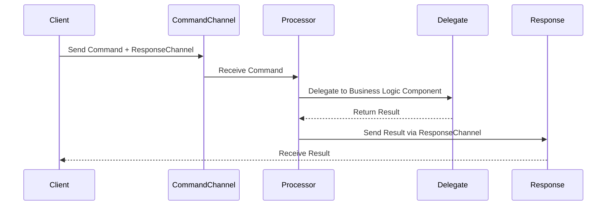
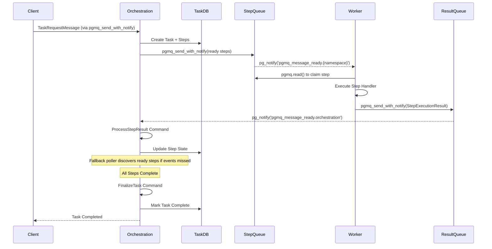
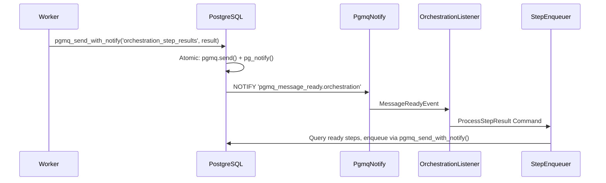
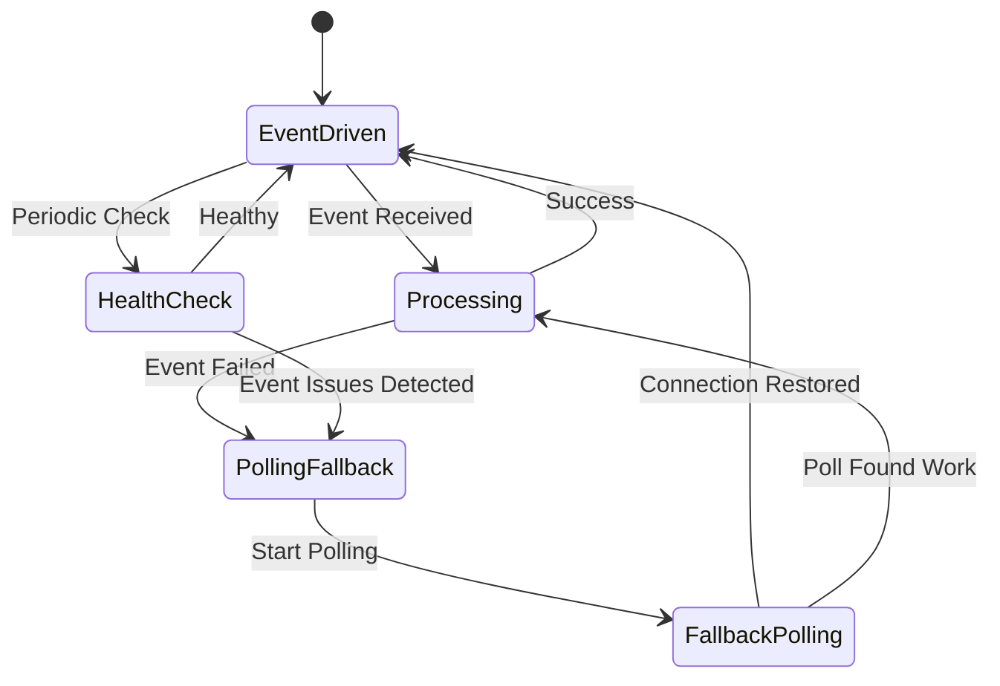

# Events and Commands Architecture

**Last Updated**: 2026-01-15
**Audience**: Architects, Developers
**Status**: Active (TAS-46 Actor Integration, TAS-133 Messaging Abstraction Complete)
**Related Docs**: [Documentation Hub](README.md) | [Actor-Based Architecture](actors.md) | [Messaging Abstraction](messaging-abstraction.md) | [States and Lifecycles](states-and-lifecycles.md) | [Deployment Patterns](deployment-patterns.md)

← Back to [Documentation Hub](README.md)

---

This document provides comprehensive documentation of the event-driven and command pattern architecture in tasker-core, covering the unified event system foundation, orchestration and worker implementations, and the flow of tasks and steps through the system.

## Overview

The tasker-core system implements a sophisticated hybrid architecture that combines:

1. **Event-Driven Systems**: Real-time coordination using PostgreSQL LISTEN/NOTIFY and PGMQ notifications
2. **Command Pattern**: Async command processors using tokio mpsc channels for orchestration and worker operations
3. **Hybrid Deployment Modes**: PollingOnly, EventDrivenOnly, and Hybrid modes with fallback polling
4. **Queue-Based Communication**: Provider-agnostic message queues (PGMQ or RabbitMQ) for reliable step execution and result processing

This architecture eliminates polling complexity while maintaining resilience through fallback mechanisms and provides horizontal scaling capabilities with atomic operation guarantees.

## Event System Foundation

### EventDrivenSystem Trait

The foundation of the event architecture is defined in `tasker-shared/src/event_system/event_driven.rs` with the `EventDrivenSystem` trait:

```rust
#[async_trait]
pub trait EventDrivenSystem: Send + Sync {
    type SystemId: Send + Sync + Clone + fmt::Display + fmt::Debug;
    type Event: Send + Sync + Clone + fmt::Debug;
    type Config: Send + Sync + Clone;
    type Statistics: EventSystemStatistics + Send + Sync + Clone;

    // Core lifecycle methods
    async fn start(&mut self) -> Result<(), DeploymentModeError>;
    async fn stop(&mut self) -> Result<(), DeploymentModeError>;
    fn is_running(&self) -> bool;

    // Event processing
    async fn process_event(&self, event: Self::Event) -> Result<(), DeploymentModeError>;

    // Monitoring and health
    async fn health_check(&self) -> Result<DeploymentModeHealthStatus, DeploymentModeError>;
    fn statistics(&self) -> Self::Statistics;

    // Configuration
    fn deployment_mode(&self) -> DeploymentMode;
    fn config(&self) -> &Self::Config;
}
```

### Deployment Modes

The system supports three deployment modes for different operational requirements:

#### PollingOnly Mode
- Traditional polling-based coordination
- No event listeners or real-time notifications
- Reliable fallback for environments with networking restrictions
- Higher latency but guaranteed operation

#### EventDrivenOnly Mode
- Pure event-driven coordination using PostgreSQL LISTEN/NOTIFY
- Real-time response to database changes
- Lowest latency for step discovery and task coordination
- Requires reliable PostgreSQL connections

#### Hybrid Mode
- Primary event-driven coordination with polling fallback
- Best of both worlds: real-time when possible, reliable when needed
- Automatic fallback during connection issues
- Production-ready with resilience guarantees

#### Selecting a Deployment Mode

The Tasker system is built with the expectation of distributed deployment with multiple instances of both orchestration core servers and worker servers operating simultaneously. The goal of separating deployment mode is to enable different deployments to scale up event driven only processing nodes to meet demand, while having polling only nodes at a reasonable fallback polling interval and batch size. It is also to deploy in hybrid mode and control these on an instance over instance level.

### Event Types and Sources

#### Queue-Level Events (Provider-Agnostic - TAS-133)

The system supports multiple messaging backends through `MessageNotification`:

```rust
pub enum MessageNotification {
    /// Signal-only notification (PGMQ style)
    /// Indicates a message is available but requires separate fetch
    Available {
        queue_name: String,
        msg_id: Option<i64>,
    },

    /// Full message notification (RabbitMQ style)
    /// Contains the complete message payload
    Message(QueuedMessage<Vec<u8>>),
}
```

**Event Sources by Provider**:

| Provider | Notification Type | Fetch Required | Fallback Polling |
|----------|-------------------|----------------|------------------|
| PGMQ | `Available` | Yes (read by msg_id) | Required |
| RabbitMQ | `Message` | No (full payload) | Not needed |
| InMemory | `Message` | No | Not needed |

**Common Event Types**:
- **Step Results**: Worker completion notifications
- **Task Requests**: New task initialization requests
- **Message Ready Events**: Queue message availability notifications
- **Transport**: Provider-agnostic via `MessagingProvider.subscribe_many()`

## Command Pattern Architecture

### TAS-40: Command Processor Replacement

Both orchestration and worker systems implement the command pattern (TAS-40) to replace complex polling-based coordinators:

**Benefits**:
- **No Polling Loops (Except where intended for fallback)**: Pure tokio mpsc command processing
- **Simplified Architecture**: ~100 lines vs 1000+ lines of complex systems
- **Race Condition Prevention**: Atomic operations through proper delegation
- **Observability Preservation**: Maintains metrics through delegated components

### Command Flow Patterns

Both systems follow consistent command processing patterns:



## Orchestration Event Systems

### OrchestrationEventSystem

Implemented in `tasker-orchestration/src/orchestration/event_systems/orchestration_event_system.rs`:

```rust
pub struct OrchestrationEventSystem {
    system_id: String,
    deployment_mode: DeploymentMode,
    queue_listener: Option<OrchestrationQueueListener>,
    fallback_poller: Option<OrchestrationFallbackPoller>,
    context: Arc<SystemContext>,
    orchestration_core: Arc<OrchestrationCore>,
    command_sender: mpsc::Sender<OrchestrationCommand>,
    // ... statistics and state
}
```

#### Orchestration Command Types

The command processor handles both full-message and signal-only notification types (TAS-133):

```rust
pub enum OrchestrationCommand {
    // Task lifecycle
    InitializeTask { request: TaskRequestMessage, resp: CommandResponder<TaskInitializeResult> },
    ProcessStepResult { result: StepExecutionResult, resp: CommandResponder<StepProcessResult> },
    FinalizeTask { task_uuid: Uuid, resp: CommandResponder<TaskFinalizationResult> },

    // Full message processing (RabbitMQ style - MessageNotification::Message)
    // Used when provider delivers complete message payload
    ProcessStepResultFromMessage { queue_name: String, message: QueuedMessage, resp: CommandResponder<StepProcessResult> },
    InitializeTaskFromMessage { queue_name: String, message: QueuedMessage, resp: CommandResponder<TaskInitializeResult> },
    FinalizeTaskFromMessage { queue_name: String, message: QueuedMessage, resp: CommandResponder<TaskFinalizationResult> },

    // Signal-only processing (PGMQ style - MessageNotification::Available)
    // Used when provider sends notification that requires separate fetch
    ProcessStepResultFromMessageEvent { message_event: MessageReadyEvent, resp: CommandResponder<StepProcessResult> },
    InitializeTaskFromMessageEvent { message_event: MessageReadyEvent, resp: CommandResponder<TaskInitializeResult> },
    FinalizeTaskFromMessageEvent { message_event: MessageReadyEvent, resp: CommandResponder<TaskFinalizationResult> },

    // Task readiness (database events)
    ProcessTaskReadiness { task_uuid: Uuid, namespace: String, priority: i32, ready_steps: i32, triggered_by: String, resp: CommandResponder<TaskReadinessResult> },

    // System operations
    GetProcessingStats { resp: CommandResponder<OrchestrationProcessingStats> },
    HealthCheck { resp: CommandResponder<SystemHealth> },
    Shutdown { resp: CommandResponder<()> },
}
```

**Command Routing by Notification Type**:
- `MessageNotification::Message` -> `*FromMessage` commands (immediate processing)
- `MessageNotification::Available` -> `*FromMessageEvent` commands (requires fetch)

#### Orchestration Queue Architecture

The orchestration system coordinates multiple queue types:

1. **orchestration_step_results**: Step completion results from workers
2. **orchestration_task_requests**: New task initialization requests
3. **orchestration_task_finalization**: Task finalization notifications
4. **Namespace Queues**: Per-namespace step queues (e.g., `fulfillment_queue`, `inventory_queue`)

### TaskReadinessEventSystem

Handles database-level events for task readiness using PostgreSQL LISTEN/NOTIFY:

```rust
pub struct TaskReadinessEventSystem {
    system_id: String,
    deployment_mode: DeploymentMode,
    listener: Option<TaskReadinessListener>,
    fallback_poller: Option<TaskReadinessFallbackPoller>,
    context: Arc<SystemContext>,
    command_sender: mpsc::Sender<OrchestrationCommand>,
    // ... configuration and statistics
}
```

**PGMQ Notification Channels**:
- `pgmq_message_ready.orchestration`: Orchestration queue messages ready (task requests, step results, finalizations)
- `pgmq_message_ready.{namespace}`: Worker namespace queue messages ready (e.g., `payments`, `fulfillment`, `linear_workflow`)
- `pgmq_message_ready`: Global channel for all queue messages (fallback)
- `pgmq_queue_created`: Queue creation notifications

### Unified Event Coordination

The `UnifiedEventCoordinator` demonstrates coordinated management of multiple event systems:

```rust
pub struct UnifiedEventCoordinator {
    orchestration_system: OrchestrationEventSystem,
    task_readiness_fallback: FallbackPoller,
    deployment_mode: DeploymentMode,
    health_monitor: EventSystemHealthMonitor,
    // ... coordination logic
}
```

**Coordination Features**:
- **Shared Command Channel**: Both systems send commands to same orchestration processor
- **Health Monitoring**: Unified health checking across all event systems
- **Deployment Mode Management**: Synchronized mode changes
- **Statistics Aggregation**: Combined metrics from all systems

## Worker Event Systems

### WorkerEventSystem

Implemented in `tasker-worker/src/worker/event_systems/worker_event_system.rs`:

```rust
pub struct WorkerEventSystem {
    system_id: String,
    deployment_mode: DeploymentMode,
    queue_listeners: HashMap<String, WorkerQueueListener>,
    fallback_pollers: HashMap<String, WorkerFallbackPoller>,
    context: Arc<SystemContext>,
    command_sender: mpsc::Sender<WorkerCommand>,
    // ... statistics and configuration
}
```

#### Worker Command Types

```rust
pub enum WorkerCommand {
    // Step execution
    ExecuteStep { message: PgmqMessage<SimpleStepMessage>, queue_name: String, resp: CommandResponder<()> },
    ExecuteStepWithCorrelation { message: PgmqMessage<SimpleStepMessage>, queue_name: String, correlation_id: Uuid, resp: CommandResponder<()> },

    // Result processing
    SendStepResult { result: StepExecutionResult, resp: CommandResponder<()> },
    ProcessStepCompletion { step_result: StepExecutionResult, correlation_id: Option<Uuid>, resp: CommandResponder<()> },

    // Event integration (TAS-43)
    ExecuteStepFromMessage { queue_name: String, message: PgmqMessage, resp: CommandResponder<()> },
    ExecuteStepFromEvent { message_event: MessageReadyEvent, resp: CommandResponder<()> },

    // System operations
    GetWorkerStatus { resp: CommandResponder<WorkerStatus> },
    SetEventIntegration { enabled: bool, resp: CommandResponder<()> },
    GetEventStatus { resp: CommandResponder<EventIntegrationStatus> },
    RefreshTemplateCache { namespace: Option<String>, resp: CommandResponder<()> },
    HealthCheck { resp: CommandResponder<WorkerHealthStatus> },
    Shutdown { resp: CommandResponder<()> },
}
```

#### Worker Queue Architecture

Workers monitor namespace-specific queues for step execution as *Custom Namespace Queues* that are dynamically configured per deployment

Example queues:

1. **fulfillment_queue**: All fulfillment namespace steps
2. **inventory_queue**: All inventory namespace steps
3. **notifications_queue**: All notification namespace steps
4. **payment_queue**: All payment processing steps

## Event Flow and System Interactions

### Complete Task Execution Flow



### Event-Driven Step Discovery



### Hybrid Mode Operation



## Queue Architecture and Message Flow

### PGMQ Integration

The system uses PostgreSQL Message Queue (PGMQ) for reliable message delivery:

#### Queue Types and Purposes

| Queue Name | Purpose | Message Type | Processing System |
|------------|---------|--------------|------------------|
| `orchestration_step_results` | Step completion results | `StepExecutionResult` | Orchestration |
| `orchestration_task_requests` | New task requests | `TaskRequestMessage` | Orchestration |
| `orchestration_task_finalization` | Task finalization | `TaskFinalizationMessage` | Orchestration |
| `{namespace}_queue` | Namespace-specific steps | `SimpleStepMessage` | Workers |

#### Message Processing Patterns

**Event-Driven Processing**:
1. Message arrives in PGMQ queue
2. PostgreSQL triggers pg_notify with `MessageReadyEvent`
3. Event system receives notification
4. System processes message via command pattern
5. Message deleted after successful processing

**Polling-Based Processing** (Fallback):
1. Periodic queue polling (configurable interval)
2. Fetch available messages in batches
3. Process messages via command pattern
4. Delete processed messages

### Circuit Breaker Integration

All PGMQ operations are protected by circuit breakers (TAS-33):

```rust
pub struct UnifiedPgmqClient {
    standard_client: Box<dyn PgmqClientTrait + Send + Sync>,
    protected_client: Option<ProtectedPgmqClient>,
    circuit_breaker_enabled: bool,
}
```

**Circuit Breaker Features**:
- **Automatic Protection**: Failure detection and circuit opening
- **Configurable Thresholds**: Error rate and timeout configuration
- **Seamless Fallback**: Automatic switching between standard and protected clients
- **Recovery Detection**: Automatic circuit closing when service recovers

## Statistics and Monitoring

### Event System Statistics

Both orchestration and worker event systems implement comprehensive statistics:

```rust
pub trait EventSystemStatistics {
    fn events_processed(&self) -> u64;
    fn events_failed(&self) -> u64;
    fn processing_rate(&self) -> f64;         // events/second
    fn average_latency_ms(&self) -> f64;
    fn deployment_mode_score(&self) -> f64;   // 0.0-1.0 effectiveness
    fn success_rate(&self) -> f64;            // derived: processed/(processed+failed)
}
```

### Health Monitoring

#### Deployment Mode Health Status

```rust
pub enum DeploymentModeHealthStatus {
    Healthy,                    // All systems operational
    Degraded { reason: String },// Some issues but functional
    Unhealthy { reason: String },// Significant issues
    Critical { reason: String }, // System failure imminent
}
```

#### Health Check Integration

- **Event System Health**: Connection status, processing latency, error rates
- **Command Processor Health**: Queue backlog, processing timeout detection
- **Database Health**: Connection pool status, query performance
- **Circuit Breaker Status**: Circuit state, failure rates, recovery status

### Metrics Collection

Key metrics collected across the system:

#### Orchestration Metrics
- **Task Initialization Rate**: Tasks/minute initialized
- **Step Enqueueing Rate**: Steps/minute enqueued to worker queues
- **Result Processing Rate**: Results/minute processed from workers
- **Task Completion Rate**: Tasks/minute completed successfully
- **Error Rates**: Failures by operation type and cause

#### Worker Metrics
- **Step Execution Rate**: Steps/minute executed
- **Handler Performance**: Execution time by handler type
- **Queue Processing**: Messages claimed/processed by queue
- **Result Submission Rate**: Results/minute sent to orchestration
- **FFI Integration**: Event correlation and handler communication stats

## Error Handling and Resilience

### Error Categories

The system handles multiple error categories with appropriate strategies:

#### Transient Errors
- **Database Connection Issues**: Circuit breaker protection + retry with exponential backoff
- **Queue Processing Failures**: Message retry with backoff, poison message detection
- **Network Interruptions**: Automatic fallback to polling mode

#### Permanent Errors
- **Invalid Message Format**: Dead letter queue for manual analysis
- **Handler Execution Failures**: Step failure state with retry limits
- **Configuration Errors**: System startup prevention with clear error messages

#### System Errors
- **Resource Exhaustion**: Graceful degradation and load shedding
- **Component Crashes**: Automatic restart with state recovery
- **Data Corruption**: Transaction rollback and consistency validation

### Fallback Mechanisms

#### Event System Fallbacks
1. **Event-Driven -> Polling**: Automatic fallback when event connection fails
2. **Real-time -> Batch**: Switch to batch processing during high load
3. **Primary -> Secondary**: Database failover support for high availability

#### Command Processing Fallbacks
1. **Async -> Sync**: Degraded operation for critical operations
2. **Distributed -> Local**: Local processing when coordination fails
3. **Optimistic -> Pessimistic**: Conservative processing during uncertainty

## Configuration Management

### Event System Configuration

Event systems are configured via TOML with environment overrides:

```toml
# config/tasker/base/event_systems.toml
[orchestration_event_system]
system_id = "orchestration-events"
deployment_mode = "Hybrid"
health_monitoring_enabled = true
health_check_interval = "30s"
max_concurrent_processors = 10
processing_timeout = "100ms"

[orchestration_event_system.queue_listener]
enabled = true
batch_size = 50
poll_interval = "1s"
connection_timeout = "5s"

[orchestration_event_system.fallback_poller]
enabled = true
poll_interval = "5s"
batch_size = 20
max_retry_attempts = 3

[task_readiness]
enabled = true
polling_interval_seconds = 30

[orchestration_event_system]
system_id = "orchestration-events"
deployment_mode = "Hybrid"
# PGMQ channels handled by listeners, not direct postgres channels
supported_namespaces = ["orchestration"]
```

### Runtime Configuration Changes

Certain configuration changes can be applied at runtime:

- **Deployment Mode Switching**: EventDrivenOnly <-> Hybrid <-> PollingOnly
- **Event Integration Toggle**: Enable/disable event processing
- **Health Check Intervals**: Adjust monitoring frequency
- **Circuit Breaker Thresholds**: Modify failure detection sensitivity

## Integration Points

### State Machine Integration

Event systems integrate tightly with the state machines documented in `states-and-lifecycles.md`:

1. **Task State Changes**: Event systems react to task transitions
2. **Step State Changes**: Step completion triggers task readiness checks
3. **Event Generation**: State transitions generate events for system coordination
4. **Atomic Operations**: Event processing maintains state machine consistency

### Database Integration

Event systems coordinate with PostgreSQL at multiple levels:

1. **LISTEN/NOTIFY**: Real-time notifications for database changes
2. **PGMQ Integration**: Reliable message queues built on PostgreSQL
3. **Transaction Coordination**: Event processing within database transactions
4. **SQL Functions**: Database functions generate events and notifications

### External System Integration

The event architecture supports integration with external systems:

1. **Webhook Events**: HTTP callbacks for external system notifications
2. **Message Bus Integration**: Apache Kafka, RabbitMQ, etc. for enterprise messaging
3. **Monitoring Integration**: Prometheus, DataDog, etc. for metrics export
4. **API Integration**: REST and GraphQL APIs for external coordination

## Actor Integration (TAS-46)

### Overview

The tasker-core system implements a **lightweight Actor pattern** that formalizes the relationship between Commands and Lifecycle Components. This architecture provides a consistent, type-safe foundation for orchestration component management with all lifecycle operations coordinated through actors.

**Status**: TAS-46 Complete (Phases 1-7) - Production ready

For comprehensive actor documentation, see [Actor-Based Architecture](actors.md).

### Actor Pattern Basics

The actor pattern introduces three core traits:

1. **OrchestrationActor**: Base trait for all actors with lifecycle hooks
2. **Handler<M>**: Message handling trait for type-safe command processing
3. **Message**: Marker trait for command messages

```rust
// Actor definition
pub struct TaskFinalizerActor {
    context: Arc<SystemContext>,
    service: TaskFinalizer,
}

// Message definition
pub struct FinalizeTaskMessage {
    pub task_uuid: Uuid,
}

impl Message for FinalizeTaskMessage {
    type Response = FinalizationResult;
}

// Message handler
#[async_trait]
impl Handler<FinalizeTaskMessage> for TaskFinalizerActor {
    type Response = FinalizationResult;

    async fn handle(&self, msg: FinalizeTaskMessage) -> TaskerResult<Self::Response> {
        self.service.finalize_task(msg.task_uuid).await
            .map_err(|e| e.into())
    }
}
```

### Integration with Command Processor

The actor pattern integrates seamlessly with the command processor through direct actor calls:

```rust
// From: tasker-orchestration/src/orchestration/command_processor.rs

async fn handle_finalize_task(&self, task_uuid: Uuid) -> TaskerResult<TaskFinalizationResult> {
    // TAS-46: Direct actor-based task finalization
    let msg = FinalizeTaskMessage { task_uuid };
    let result = self.actors.task_finalizer_actor.handle(msg).await?;

    Ok(TaskFinalizationResult::Success {
        task_uuid: result.task_uuid,
        final_status: format!("{:?}", result.action),
        completion_time: Some(chrono::Utc::now()),
    })
}

async fn handle_process_step_result(
    &self,
    step_result: StepExecutionResult,
) -> TaskerResult<StepProcessResult> {
    // TAS-46: Direct actor-based step result processing
    let msg = ProcessStepResultMessage {
        result: step_result.clone(),
    };

    match self.actors.result_processor_actor.handle(msg).await {
        Ok(()) => Ok(StepProcessResult::Success {
            message: format!(
                "Step {} result processed successfully",
                step_result.step_uuid
            ),
        }),
        Err(e) => Ok(StepProcessResult::Error {
            message: format!("Failed to process step result: {e}"),
        }),
    }
}
```

### Event → Command → Actor Flow

The complete event-to-actor flow:

```
┌──────────────┐
│ PGMQ Message │ Message arrives in queue
└──────┬───────┘
       │
       ▼
┌──────────────────┐
│  Event Listener  │ EventDrivenSystem processes notification
└──────┬───────────┘
       │
       ▼
┌──────────────────┐
│ Command Channel  │ Send command to processor via tokio::mpsc
└──────┬───────────┘
       │
       ▼
┌──────────────────┐
│ Command Processor│ Convert command to actor message
└──────┬───────────┘
       │
       ▼
┌──────────────────┐
│  Actor Registry  │ Route message to appropriate actor
└──────┬───────────┘
       │
       ▼
┌──────────────────┐
│ Handler<M>::     │ Actor processes message
│    handle()      │ Delegates to underlying service
└──────┬───────────┘
       │
       ▼
┌──────────────────┐
│  Response        │ Return result to command processor
└──────────────────┘
```

### ActorRegistry and Lifecycle

The `ActorRegistry` manages all 4 orchestration actors and integrates with the system lifecycle:

```rust
// During system startup
let context = Arc::new(SystemContext::with_pool(pool).await?);
let actors = ActorRegistry::build(context).await?;  // Calls started() on all actors

// During operation
let msg = FinalizeTaskMessage { task_uuid };
let result = actors.task_finalizer_actor.handle(msg).await?;

// During shutdown
actors.shutdown().await;  // Calls stopped() on all actors in reverse order
```

**Current Actors** (TAS-46 Phase 2-3):
- **TaskRequestActor**: Handles task initialization requests
- **ResultProcessorActor**: Processes step execution results
- **StepEnqueuerActor**: Manages batch processing of ready tasks
- **TaskFinalizerActor**: Handles task finalization with atomic claiming

### Benefits for Event-Driven Architecture

The actor pattern enhances the event-driven architecture by providing:

1. **Type Safety**: Compile-time verification of message contracts
2. **Consistency**: Uniform lifecycle management across all components
3. **Testability**: Clear message boundaries for isolated testing
4. **Observability**: Actor-level metrics and tracing
5. **Evolvability**: Easy to add new message handlers and actors

### Implementation Status

The actor integration is complete (TAS-46 Phases 1-7):

1. **Phase 1** ✅: Actor infrastructure and test harness
   - OrchestrationActor, Handler<M>, Message traits
   - ActorRegistry structure

2. **Phase 2-3** ✅: All 4 primary actors implemented
   - TaskRequestActor, ResultProcessorActor
   - StepEnqueuerActor, TaskFinalizerActor

3. **Phase 4-6** ✅: Message hydration and module reorganization
   - Hydration layer for PGMQ messages
   - Clean module organization

4. **Phase 7** ✅: Service decomposition
   - Large services decomposed into focused components
   - All files <300 lines following single responsibility principle

5. **Cleanup** ✅: Direct actor integration
   - Command processor calls actors directly
   - Removed intermediate wrapper layers
   - Production-ready implementation

### Service Decomposition

Large services (800-900 lines) were decomposed into focused components:

**TaskFinalizer** (848 → 6 files):
- `service.rs`: Main TaskFinalizer (~200 lines)
- `completion_handler.rs`: Task completion logic
- `event_publisher.rs`: Lifecycle event publishing
- `execution_context_provider.rs`: Context fetching
- `state_handlers.rs`: State-specific handling

**StepEnqueuerService** (781 → 3 files):
- `service.rs`: Main service (~250 lines)
- `batch_processor.rs`: Batch processing logic
- `state_handlers.rs`: State-specific processing

**ResultProcessor** (889 → 4 files):
- `service.rs`: Main processor
- `metadata_processor.rs`: Metadata handling
- `error_handler.rs`: Error processing
- `result_validator.rs`: Result validation

---

This comprehensive event and command architecture, now enhanced with the actor pattern, provides the foundation for scalable, reliable, and maintainable workflow orchestration in the tasker-core system while maintaining the flexibility to operate in diverse deployment environments.
