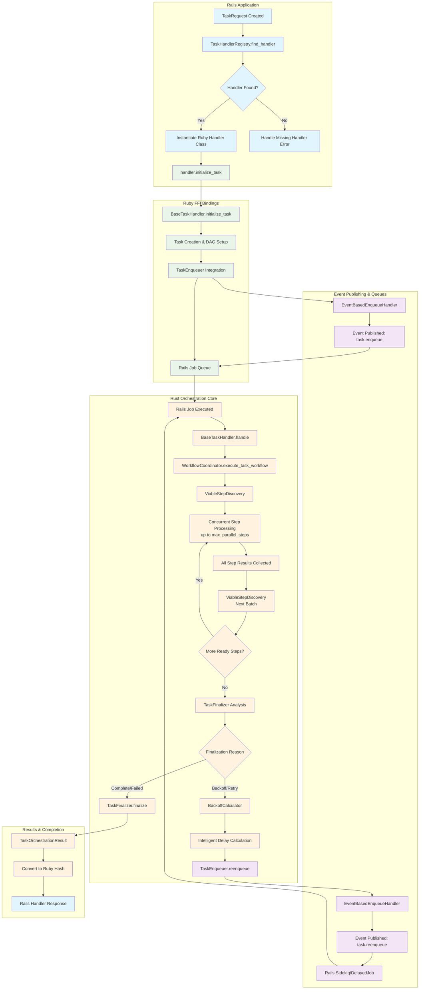

# Ruby Bindings for Tasker Core

## Overview

This directory contains Ruby FFI bindings that enable Rails applications to integrate with the Rust-powered Tasker Core orchestration engine. The bindings provide Ruby base classes that Rails handlers can inherit from while delegating the heavy orchestration work to Rust.

## Architecture

The Ruby bindings follow a delegation pattern where:
- **Ruby handles**: Business logic, framework integration, job queuing
- **Rust handles**: Orchestration, state management, dependency resolution, performance-critical operations

## Ruby-Rust Integration Workflow

Based on the complete task lifecycle, here is how Rails applications integrate with Tasker Core:

### Complete Workflow Diagram



### Detailed Code Path Analysis

#### Phase 1: Task Discovery & Registration

**Rails Application → TaskHandlerRegistry**
```ruby
# Rails Controller/Service
task_request = TaskRequest.new(name: "payment_processor", namespace: "payments", version: "1.0.0")
registry = TaskerCore::TaskHandlerRegistry.new
result = registry.find_handler_for_task_request(task_request)

if result["found"]
  handler_class = result["ruby_class_name"]  # "PaymentTaskHandler"
  yaml_config = result["yaml_template"]      # Full YAML configuration
  rails_handler = handler_class.constantize.new(yaml_config)
end
```

**Code Paths:**
- `TaskHandlerRegistry.find_handler_for_task_request` → Ruby FFI boundary
- `find_handler_async` → File system YAML search (`config/tasker/tasks/`)
- `HandlerConfiguration.from_yaml_file` → Parse and validate configuration
- Return Ruby class name + template data to Rails

#### Phase 2: Task Initialization & DAG Setup

**Rails Handler → BaseTaskHandler**
```ruby
# Rails calls the instantiated handler
result = rails_handler.initialize_task(task_request)
```

**Code Paths:**
- `BaseTaskHandler.initialize_task` → Ruby FFI to Rust
- `create_task_from_request` → Async Rust task creation:
  - `Task.from_task_request` → Create Task record
  - `WorkflowStep.create` → Create step records from YAML templates
  - `WorkflowStepEdge.create` → Establish DAG dependencies
  - `TaskTransition.create` → Initialize state machine (PENDING)
  - `WorkflowStepTransition.create` → Initialize step states

#### Phase 3: Task Enqueuing

**BaseTaskHandler → TaskEnqueuer → Rails Job Queue**
```rust
// Inside initialize_task after successful creation
let enqueue_request = EnqueueRequest::new(task)
    .with_reason("Task initialized and ready for processing")
    .with_priority(EnqueuePriority::Normal);

task_enqueuer.enqueue(enqueue_request).await?;
```

**Code Paths:**
- `TaskEnqueuer.enqueue` → Uses default handler (EventBasedEnqueueHandler)
- `EventBasedEnqueueHandler.handle_enqueue` → Publishes event:
  ```json
  {
    "event": "task.enqueue",
    "data": {
      "task_id": 123,
      "operation": "enqueue",
      "priority": "normal",
      "delay_seconds": 0
    }
  }
  ```
- Rails EventSubscriber receives event → `Sidekiq.perform_later(task_id)`

#### Phase 4: Task Execution & Concurrent Orchestration

**Rails Job → BaseTaskHandler → WorkflowCoordinator**
```ruby
# Rails Job (Sidekiq/DelayedJob)
class TaskRunnerJob < ApplicationJob
  def perform(task_id)
    handler = TaskHandlerRegistry.find_handler_for_task(task_id)
    result = handler.handle(task_id)  # Primitive interface - just task_id
  end
end
```

**Code Paths:**
- `BaseTaskHandler.handle(task_id)` → Ruby FFI to Rust
- `WorkflowCoordinator.execute_task_workflow` → **Concurrent orchestration loop**:

#### Phase 5: Concurrent Step Processing Loop

**WorkflowCoordinator Concurrent Processing**
```rust
// Simplified orchestration loop showing concurrent processing
loop {
    // 1. Find all currently viable steps using SQL functions
    let viable_steps = ViableStepDiscovery::find_ready_steps(pool, task_id).await?;
    
    if viable_steps.is_empty() {
        break; // No more ready steps - proceed to TaskFinalizer analysis
    }
    
    // 2. Process steps concurrently up to max_parallel_steps configuration
    let concurrent_futures: Vec<_> = viable_steps
        .into_iter()
        .take(max_parallel_steps)
        .map(|step| framework_integration.execute_single_step(&step, &task_context))
        .collect();
    
    // 3. Wait for all concurrent step executions to complete
    let step_results = futures::future::join_all(concurrent_futures).await;
    
    // 4. Process results and update state machine
    for result in step_results {
        step_executor.process_step_result(result).await?;
    }
    
    // 5. Loop back to check for newly viable steps
    // Dependencies may now be satisfied, unlocking more work
}

// 6. No more ready steps - hand off to TaskFinalizer for analysis
let finalization_outcome = task_finalizer.analyze_completion_status(task_id).await?;
```

**Ruby Step Handler Delegation (within execute_single_step)**
```rust
// In RubyFrameworkIntegration.execute_single_step
async fn execute_single_step(&self, step: &ViableStep, context: &TaskContext) -> StepResult {
    // TODO: Current implementation - needs Ruby delegation
    // 1. Convert Rust ViableStep to Ruby objects
    // 2. Look up Ruby step handler by step.name (e.g., "PaymentStepHandler")
    // 3. Call handler.process(task, sequence, step) concurrently
    // 4. Convert Ruby result back to Rust StepResult
}
```

**Ruby Step Handler Pattern (Executed Concurrently)**
```ruby
class PaymentStepHandler < TaskerCore::BaseStepHandler
  def process(task, sequence, step)
    # This runs concurrently with other step handlers
    # Business logic - API calls, database operations, etc.
    PaymentService.process_payment(step.input_data)
    { success: true, data: payment_result }
  end
end
```

#### Phase 6: TaskFinalizer Analysis & Intelligent Backoff

**TaskFinalizer Handles ALL Completion Decisions**
```rust
// TaskFinalizer analyzes why there are no more ready steps
let finalization_outcome = task_finalizer.analyze_completion_status(task_id).await?;

match finalization_outcome {
    FinalizationOutcome::TaskComplete => {
        // All steps successful - task is complete
        task_finalizer.finalize_successful_task(task_id).await?;
        TaskOrchestrationResult::Complete { .. }
    }
    
    FinalizationOutcome::TaskFailed { permanent_errors } => {
        // Permanent failures or exhausted retry attempts
        task_finalizer.finalize_failed_task(task_id, permanent_errors).await?;
        TaskOrchestrationResult::Failed { .. }
    }
    
    FinalizationOutcome::TaskBlocked { blocking_reason } => {
        // Waiting for external dependencies
        task_finalizer.mark_task_blocked(task_id, blocking_reason).await?;
        TaskOrchestrationResult::Blocked { .. }
    }
    
    FinalizationOutcome::RetryViable { retry_steps, earliest_retry_time } => {
        // Steps in backoff/retry state - calculate intelligent delay
        let delay = backoff_calculator.calculate_optimal_delay(
            retry_steps,
            task_execution_context,
            earliest_retry_time
        ).await?;
        
        // Hand off to TaskEnqueuer for re-enqueuing with calculated delay
        let reenqueue_request = EnqueueRequest::reenqueue(task)
            .with_delay(delay.as_secs() as u32)
            .with_reason("Steps in backoff - retry viable")
            .with_metadata("retry_analysis", retry_analysis);
        
        task_enqueuer.enqueue(reenqueue_request).await?;
        TaskOrchestrationResult::InProgress { next_poll_delay_ms: delay.as_millis() as u64, .. }
    }
}
```

**BackoffCalculator Intelligence**
```rust
// BackoffCalculator considers multiple factors for optimal delay
impl BackoffCalculator {
    async fn calculate_optimal_delay(&self, 
        retry_steps: Vec<StepRetryInfo>, 
        context: &TaskExecutionContext,
        earliest_retry_time: DateTime<Utc>
    ) -> Duration {
        // 1. Find the earliest step that can be retried
        // 2. Consider exponential backoff with jitter
        // 3. Respect server-requested retry delays (e.g., 429 responses)
        // 4. Account for external system backoff windows
        // 5. Apply context-aware scaling (high priority = shorter delays)
        
        let base_delay = earliest_retry_time - Utc::now();
        let jittered_delay = self.apply_jitter(base_delay);
        let context_adjusted = self.apply_context_scaling(jittered_delay, context);
        
        context_adjusted.max(Duration::from_secs(1)) // Minimum 1 second
    }
}
```

#### Phase 7: Event Publishing & Framework Integration

**EventBasedEnqueueHandler → Rails EventSubscriber**
```ruby
# Rails Event Subscriber (in initializer)
TaskerCore::EventPublisher.subscribe do |event|
  case event.name
  when "task.enqueue"
    TaskRunnerJob.perform_later(event.data["task_id"])
  when "task.reenqueue" 
    delay = event.data["delay_seconds"] || 0
    TaskRunnerJob.set(wait: delay.seconds).perform_later(event.data["task_id"])
  when "task.failed"
    ErrorNotificationService.alert(event.data)
  end
end
```

### Key Integration Points

#### 1. **TaskHandlerRegistry** (✅ Implemented)
- **File**: `bindings/ruby/src/handlers.rs:37-257`
- **Function**: YAML configuration lookup, Ruby class name resolution
- **Integration**: Rails → Rust FFI for handler discovery

#### 2. **Concurrent Step Processing** (🚧 Needs FrameworkIntegration)
- **Files**: `src/orchestration/workflow_coordinator.rs`, `src/orchestration/viable_step_discovery.rs`
- **Function**: SQL-based step discovery → concurrent execution up to `max_parallel_steps`
- **Integration**: Uses `futures::future::join_all()` for concurrent Ruby step handler delegation

#### 3. **TaskFinalizer Intelligence** (🚧 Needs Backoff Integration)  
- **File**: `src/orchestration/task_finalizer.rs`
- **Function**: Analyzes completion status and determines next action (complete, failed, blocked, retry viable)
- **Integration**: SQL functions determine step readiness status → BackoffCalculator → TaskEnqueuer

#### 4. **TaskEnqueuer with Intelligent Backoff** (✅ Framework Ready, 🚧 Needs Rails Integration)
- **File**: `src/orchestration/task_enqueuer.rs`
- **Function**: Event-based enqueuing with BackoffCalculator integration for optimal retry delays
- **Integration**: Rust → EventPublisher → Rails EventSubscriber → Job Queue with calculated delays

#### 5. **RubyFrameworkIntegration** (🚧 Critical: Needs Step Delegation)
- **File**: `bindings/ruby/src/handlers.rs:772-886`
- **Function**: Rust → Ruby step handler delegation within concurrent processing loop
- **Integration**: WorkflowCoordinator → Ruby step handlers (concurrently) → StepResult collection

#### 6. **Event Publishing Bridge** (🚧 Needs Implementation)
- **Function**: Rust EventPublisher → Ruby EventSubscriber with task lifecycle events
- **Integration**: Rust events → Rails job queue management with priority and delay handling

### Performance & Error Boundaries

**Async Boundaries:**
- Ruby FFI calls → Tokio runtime (blocking bridge)
- Rust orchestration → Fully async/await
- EventPublisher → Non-blocking channel broadcasting

**Error Translation:**
- Rust `OrchestrationError` → Ruby exceptions
- Ruby step handler exceptions → Rust `StepResult::Failed`
- Database errors → Proper propagation across FFI boundary

**Memory Management:**
- Primitive interfaces (task_id) minimize Ruby object lifecycle issues
- JSON serialization for complex data across FFI boundary
- Singleton database pool pattern for connection reuse

## Implementation Status

### ✅ Implemented
- **BaseStepHandler**: Ruby base class for step handlers with process/process_results hooks
- **BaseTaskHandler**: Ruby base class for task handlers with initialize_task/handle methods
- **Task Initialization**: Complete TaskRequest → Task creation with proper state machine setup
- **Database Integration**: Proper Task, WorkflowStep, and state transition creation
- **Orchestration Delegation**: handle() method properly delegates to WorkflowCoordinator
- **Result Conversion**: TaskOrchestrationResult → Ruby conversion
- **TaskHandlerRegistry**: Complete handler lookup by name/namespace/version with Ruby class names and YAML template data

### 🚧 TODO - Critical Missing Pieces

#### TaskEnqueuer Integration  
- **Job Creation**: No implementation of TaskEnqueuer for Rails job queue integration
- **Framework Abstraction**: No abstraction for different job queue systems (Sidekiq, etc.)

#### FrameworkIntegration Step Execution
- **Ruby Step Delegation**: FrameworkIntegration trait has placeholder for step execution
- **Type Conversion**: No Rust → Ruby object conversion for step execution
- **Handler Lookup**: No mechanism to find Ruby step handler classes
- **Result Processing**: No Ruby result → Rust conversion

#### Error Handling & Edge Cases
- **Configuration Errors**: No handling when YAML templates are missing/invalid
- **Registry Misses**: No handling when task handlers aren't found
- **Ruby Exceptions**: No conversion of Ruby exceptions to Rust OrchestrationError

### 🤔 Potential Misunderstandings

#### Methods That May Not Be Needed
- **validate_task_config**: May be Rails-specific, unclear if needed in Rust context
- **ruby_hash_to_config**: Might be over-engineering the FFI boundary
- Some FrameworkIntegration methods may duplicate BaseTaskHandler functionality

#### Architecture Questions
- Should TaskHandlerRegistry be in Rust or Ruby space?
- How should YAML template data flow between Rust registry and Ruby instantiation?
- What's the optimal boundary between Rust orchestration and Ruby business logic?

## Next Steps (Priority Order)

1. **RubyFrameworkIntegration Step Delegation** (Critical Blocker)
   - Implement Ruby step handler lookup and delegation within `execute_single_step`
   - Convert Rust `ViableStep` → Ruby objects for handler.process() calls
   - Convert Ruby results → Rust `StepResult` for concurrent collection
   - Enable the sophisticated concurrent processing loop

2. **TaskEnqueuer Rails Integration** (High Priority)
   - Implement Rails EventSubscriber for task.enqueue/task.reenqueue events
   - Integrate with Sidekiq/DelayedJob for job creation with calculated delays
   - Handle priority mapping and queue routing

3. **Event Publishing Bridge** (High Priority)
   - Expose Rust EventPublisher to Ruby runtime
   - Implement Rails subscriber pattern for task lifecycle events
   - Enable task.failed, task.completed, task.blocked event handling

4. **BackoffCalculator Integration** (Medium Priority)
   - Integrate TaskFinalizer with BackoffCalculator for intelligent retry delays
   - Implement server-requested retry delay handling (e.g., 429 responses)
   - Add context-aware scaling (high priority tasks = shorter delays)

5. **Magnus Registration** (Medium Priority)
   - Implement Ruby class registration for TaskHandlerRegistry and base handlers
   - Enable actual Ruby usage of TaskerCore classes
   - Add method signatures for all Ruby-exposed functions

6. **Error Handling & Translation** (Medium Priority)
   - Comprehensive Rust → Ruby exception translation
   - Ruby step handler exception → Rust StepResult::Failed conversion
   - Database error propagation across FFI boundary

7. **Integration Testing** (Medium Priority)
   - End-to-end workflow tests exercising concurrent processing
   - TaskFinalizer decision tree testing
   - Backoff calculation and re-enqueuing validation

This workflow analysis will guide the remaining implementation to ensure all pieces connect properly for a seamless Rails-Rust integration.