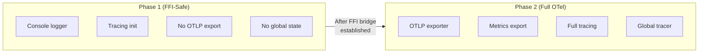
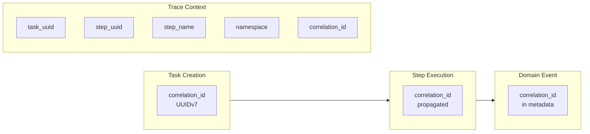

# OpenTelemetry Improvements (TAS-65)

**Last Updated**: 2025-12-01
**Audience**: Developers, Operators
**Status**: Active
**Related Docs**: [Observability Hub](README.md) | [Metrics Reference](metrics-reference.md) | [Domain Events](../domain-events.md)

← Back to [Observability Hub](README.md)

---

This document describes the OpenTelemetry improvements implemented as part of TAS-65, including two-phase FFI telemetry initialization, domain event metrics, and enhanced observability for the distributed event system.

## Overview

TAS-65 introduced several telemetry improvements to support the domain event system while addressing FFI-specific challenges:

| Improvement | Purpose | Impact |
|-------------|---------|--------|
| **Two-Phase FFI Telemetry** | Safe telemetry in FFI workers | No segfaults during Ruby/Python bridging |
| **Domain Event Metrics** | Event system observability | Real-time monitoring of event publication |
| **Correlation ID Propagation** | End-to-end tracing | Events traceable across distributed system |
| **Worker Metrics Endpoint** | Domain event statistics | `/metrics/events` for monitoring dashboards |

## Two-Phase FFI Telemetry Initialization

### The Problem

When Rust workers operate with Ruby FFI bindings, OpenTelemetry's global tracer/meter providers can cause issues:

1. **Thread Safety**: Ruby's GVL (Global VM Lock) conflicts with OpenTelemetry's internal threading
2. **Signal Handling**: OpenTelemetry's OTLP exporter may interfere with Ruby signal handling
3. **Segfaults**: Premature initialization can cause crashes during FFI boundary crossings

### The Solution: Two-Phase Initialization



Worker Bootstrap Sequence:
1. Load Rust worker library
2. Initialize Phase 1 (console-only logging)
3. Execute FFI bridge setup (Ruby/Python)
4. Initialize Phase 2 (full OpenTelemetry)

### Implementation

**Phase 1: Console-Only Initialization** (FFI-Safe):

```rust
// tasker-shared/src/logging.rs (lines 284-326)

/// Initialize console-only logging (FFI-safe, no Tokio runtime required)
///
/// This function sets up structured console logging without OpenTelemetry,
/// making it safe to call from FFI initialization contexts where no Tokio
/// runtime exists yet.
pub fn init_console_only() {
    TRACING_INITIALIZED.get_or_init(|| {
        let environment = get_environment();
        let log_level = get_log_level(&environment);

        // Determine if we're in a TTY for ANSI color support
        let use_ansi = IsTerminal::is_terminal(&std::io::stdout());

        // Create base console layer
        let console_layer = fmt::layer()
            .with_target(true)
            .with_thread_ids(true)
            .with_level(true)
            .with_ansi(use_ansi)
            .with_filter(EnvFilter::new(&log_level));

        // Build subscriber with console layer only (no telemetry)
        let subscriber = tracing_subscriber::registry().with(console_layer);

        if subscriber.try_init().is_err() {
            tracing::debug!(
                "Global tracing subscriber already initialized"
            );
        } else {
            tracing::info!(
                environment = %environment,
                opentelemetry_enabled = false,
                context = "ffi_initialization",
                "Console-only logging initialized (FFI-safe mode)"
            );
        }

        // Initialize basic metrics (no OpenTelemetry exporters)
        metrics::init_metrics();
        metrics::orchestration::init();
        metrics::worker::init();
        metrics::database::init();
        metrics::messaging::init();
    });
}
```

**Phase 2: Full OpenTelemetry Initialization**:

```rust
// tasker-shared/src/logging.rs (lines 361-449)

/// Initialize tracing with console output and optional OpenTelemetry
///
/// When OpenTelemetry is enabled (via TELEMETRY_ENABLED=true), it also
/// configures distributed tracing with OTLP exporter.
///
/// **IMPORTANT**: When telemetry is enabled, this function MUST be called from
/// a Tokio runtime context because the batch exporter requires async I/O.
pub fn init_tracing() {
    TRACING_INITIALIZED.get_or_init(|| {
        let environment = get_environment();
        let log_level = get_log_level(&environment);
        let telemetry_config = TelemetryConfig::default();

        // Determine if we're in a TTY for ANSI color support
        let use_ansi = IsTerminal::is_terminal(&std::io::stdout());

        // Create base console layer
        let console_layer = fmt::layer()
            .with_target(true)
            .with_thread_ids(true)
            .with_level(true)
            .with_ansi(use_ansi)
            .with_filter(EnvFilter::new(&log_level));

        // Build subscriber with optional OpenTelemetry layer
        let subscriber = tracing_subscriber::registry().with(console_layer);

        if telemetry_config.enabled {
            // Initialize OpenTelemetry tracer and logger
            match (init_opentelemetry_tracer(&telemetry_config),
                   init_opentelemetry_logger(&telemetry_config)) {
                (Ok(tracer_provider), Ok(logger_provider)) => {
                    // Add trace layer
                    let tracer = tracer_provider.tracer("tasker-core");
                    let telemetry_layer = OpenTelemetryLayer::new(tracer);

                    // Add log layer (bridge tracing logs -> OTEL logs)
                    let log_layer = OpenTelemetryTracingBridge::new(&logger_provider);

                    let subscriber = subscriber.with(telemetry_layer).with(log_layer);

                    if subscriber.try_init().is_ok() {
                        tracing::info!(
                            environment = %environment,
                            opentelemetry_enabled = true,
                            logs_enabled = true,
                            otlp_endpoint = %telemetry_config.otlp_endpoint,
                            service_name = %telemetry_config.service_name,
                            "Console logging with OpenTelemetry initialized"
                        );
                    }
                }
                // ... error handling with fallback to console-only
            }
        }
    });
}
```

**Worker Bootstrap Integration**:

```rust
// workers/rust/src/bootstrap.rs (lines 69-131)

pub async fn bootstrap() -> Result<(WorkerSystemHandle, RustEventHandler)> {
    info!("📋 Creating native Rust step handler registry...");
    let registry = Arc::new(RustStepHandlerRegistry::new());

    // Get global event system for connecting to worker events
    info!("🔗 Setting up event system connection...");
    let event_system = get_global_event_system();

    // Bootstrap the worker using tasker-worker foundation
    info!("🏗️  Bootstrapping worker with tasker-worker foundation...");
    let worker_handle =
        WorkerBootstrap::bootstrap_with_event_system(Some(event_system.clone())).await?;

    // TAS-65: Create step event publisher registry with domain event publisher
    info!("🔔 Setting up step event publisher registry...");
    let domain_event_publisher = {
        let worker_core = worker_handle.worker_core.lock().await;
        worker_core.domain_event_publisher()
    };

    // TAS-65 Dual-Path: Create in-process event bus for fast event delivery
    info!("⚡ Creating in-process event bus for fast domain events...");
    let in_process_bus = Arc::new(RwLock::new(InProcessEventBus::new(
        InProcessEventBusConfig::default(),
    )));

    // TAS-65 Dual-Path: Create event router for dual-path delivery
    info!("🔀 Creating event router for dual-path delivery...");
    let event_router = Arc::new(RwLock::new(EventRouter::new(
        domain_event_publisher.clone(),
        in_process_bus.clone(),
    )));

    // Create registry with EventRouter for dual-path delivery
    let mut step_event_registry =
        StepEventPublisherRegistry::with_event_router(
            domain_event_publisher.clone(),
            event_router
        );

    Ok((worker_handle, event_handler))
}
```

### Configuration

Telemetry is configured **exclusively via environment variables**. This is intentional because
logging must be initialized before the TOML config loader runs (to log any config loading errors).

```bash
# Enable OpenTelemetry
export TELEMETRY_ENABLED=true

# OTLP endpoint (default: http://localhost:4317)
export OTEL_EXPORTER_OTLP_ENDPOINT=http://localhost:4317

# Service identification
export OTEL_SERVICE_NAME=tasker-orchestration
export OTEL_SERVICE_VERSION=0.1.0

# Deployment environment (falls back to TASKER_ENV, then "development")
export DEPLOYMENT_ENVIRONMENT=production

# Sampling rate (0.0 to 1.0, default: 1.0 = 100%)
export OTEL_TRACES_SAMPLER_ARG=1.0
```

The `TelemetryConfig::default()` implementation in `tasker-shared/src/logging.rs:144-164`
reads all values from environment variables at initialization time.

## Domain Event Metrics

### New Metrics

TAS-65 introduces metrics for domain event observability:

| Metric | Type | Description |
|--------|------|-------------|
| `tasker.domain_events.published.total` | Counter | Total events published |
| `router.durable_routed` | Counter | Events sent via durable path (PGMQ) |
| `router.fast_routed` | Counter | Events sent via fast path (in-process) |
| `router.broadcast_routed` | Counter | Events broadcast to both paths |

### Implementation

Domain event metrics are emitted inline during publication:

```rust
// tasker-shared/src/events/domain_events.rs (lines 207-219)

// Emit OpenTelemetry metric
let counter = opentelemetry::global::meter("tasker")
    .u64_counter("tasker.domain_events.published.total")
    .with_description("Total number of domain events published")
    .build();

counter.add(
    1,
    &[
        opentelemetry::KeyValue::new("event_name", event_name.to_string()),
        opentelemetry::KeyValue::new("namespace", metadata.namespace.clone()),
    ],
);
```

Event routing statistics are tracked in the `EventRouterStats` and `InProcessEventBusStats` structures:

```rust
// tasker-shared/src/metrics/worker.rs (lines 431-444)

/// Statistics for the event router
#[derive(Debug, Clone, Default, serde::Serialize, serde::Deserialize)]
pub struct EventRouterStats {
    /// Total events routed through the router
    pub total_routed: u64,
    /// Events sent via durable path (PGMQ)
    pub durable_routed: u64,
    /// Events sent via fast path (in-process)
    pub fast_routed: u64,
    /// Events broadcast to both paths
    pub broadcast_routed: u64,
    /// Fast delivery errors in broadcast mode (non-fatal, logged for monitoring)
    pub fast_delivery_errors: u64,
    /// Failed routing attempts (durable failures only)
    pub routing_errors: u64,
}

// tasker-shared/src/metrics/worker.rs (lines 455-467)

/// Statistics for the in-process event bus
#[derive(Debug, Clone, Default, serde::Serialize, serde::Deserialize)]
pub struct InProcessEventBusStats {
    /// Total events dispatched through the bus
    pub total_events_dispatched: u64,
    /// Total events dispatched to Rust handlers
    pub rust_handler_dispatches: u64,
    /// Total events dispatched to FFI channel
    pub ffi_channel_dispatches: u64,
}
```

### Prometheus Queries

**Event publication rate by namespace:**
```promql
sum by (namespace) (rate(tasker_domain_events_published_total[5m]))
```

**Event failure rate:**
```promql
rate(tasker_domain_events_failed_total[5m]) /
rate(tasker_domain_events_published_total[5m])
```

**Publication latency (P95):**
```promql
histogram_quantile(0.95,
  sum by (le) (rate(tasker_domain_events_publish_duration_milliseconds_bucket[5m]))
)
```

**Latency by delivery mode:**
```promql
histogram_quantile(0.95,
  sum by (delivery_mode, le) (
    rate(tasker_domain_events_publish_duration_milliseconds_bucket[5m])
  )
)
```

## Worker Metrics Endpoint

### `/metrics/events` Endpoint

The worker exposes domain event statistics through a dedicated metrics endpoint:

**Request:**
```bash
curl http://localhost:8081/metrics/events
```

**Response:**
```json
{
  "router": {
    "total_routed": 42,
    "durable_routed": 10,
    "fast_routed": 30,
    "broadcast_routed": 2,
    "fast_delivery_errors": 0,
    "routing_errors": 0
  },
  "in_process_bus": {
    "total_events_dispatched": 32,
    "rust_handler_dispatches": 20,
    "ffi_channel_dispatches": 12
  },
  "captured_at": "2025-12-01T10:30:00Z",
  "worker_id": "worker-01234567"
}
```

### Implementation

```rust
// tasker-worker/src/web/handlers/metrics.rs (lines 178-218)

/// Domain event statistics endpoint: GET /metrics/events
///
/// Returns statistics about domain event routing and delivery paths.
/// Used for monitoring event publishing and by E2E tests to verify
/// events were published through the expected delivery paths.
///
/// # Response
///
/// Returns statistics for:
/// - **Router stats**: durable_routed, fast_routed, broadcast_routed counts
/// - **In-process bus stats**: handler dispatches, FFI channel dispatches
pub async fn domain_event_stats(
    State(state): State<Arc<WorkerWebState>>,
) -> Json<DomainEventStats> {
    debug!("Serving domain event statistics");

    // Use cached event components - does not lock worker core
    let stats = state.domain_event_stats().await;

    Json(stats)
}
```

The `DomainEventStats` structure is defined in `tasker-shared/src/types/web.rs`:

```rust
// tasker-shared/src/types/web.rs (lines 546-555)

#[derive(Debug, Clone, Serialize, Deserialize, Default)]
pub struct DomainEventStats {
    /// Event router statistics
    pub router: EventRouterStats,
    /// In-process event bus statistics
    pub in_process_bus: InProcessEventBusStats,
    /// Timestamp when stats were captured
    pub captured_at: DateTime<Utc>,
    /// Worker ID for correlation
    pub worker_id: String,
}
```

## Correlation ID Propagation

### End-to-End Tracing

Domain events maintain correlation IDs for distributed tracing:



### Tracing Integration

The `DomainEventPublisher::publish_event` method uses `#[instrument]` for automatic span creation:

```rust
// tasker-shared/src/events/domain_events.rs (lines 157-231)

#[instrument(skip(self, payload, metadata), fields(
    event_name = %event_name,
    namespace = %metadata.namespace,
    correlation_id = %metadata.correlation_id
))]
pub async fn publish_event(
    &self,
    event_name: &str,
    payload: DomainEventPayload,
    metadata: EventMetadata,
) -> Result<Uuid, DomainEventError> {
    let event_id = Uuid::now_v7();
    let queue_name = format!("{}_domain_events", metadata.namespace);

    debug!(
        event_id = %event_id,
        event_name = %event_name,
        queue_name = %queue_name,
        task_uuid = %metadata.task_uuid,
        correlation_id = %metadata.correlation_id,
        "Publishing domain event"
    );

    // Create and serialize domain event
    let event = DomainEvent {
        event_id,
        event_name: event_name.to_string(),
        event_version: "1.0".to_string(),
        payload,
        metadata: metadata.clone(),
    };

    // Publish to PGMQ
    let message_id = self.message_client
        .send_json_message(&queue_name, &event_json)
        .await?;

    info!(
        event_id = %event_id,
        message_id = message_id,
        correlation_id = %metadata.correlation_id,
        "Domain event published successfully"
    );

    Ok(event_id)
}
```

### Querying by Correlation ID

**Find all events for a task:**
```bash
# In Grafana/Tempo
correlation_id = "0199c3e0-ccdb-7581-87ab-3f67daeaa4a5"
```

**In PostgreSQL (PGMQ queues):**
```sql
SELECT
    message->>'event_name' as event,
    message->'metadata'->>'step_name' as step,
    message->'metadata'->>'fired_at' as fired_at
FROM pgmq.q_payments_domain_events
WHERE message->'metadata'->>'correlation_id' = '0199c3e0-ccdb-7581-87ab-3f67daeaa4a5'
ORDER BY message->'metadata'->>'fired_at';
```

## Span Hierarchy

### Domain Event Spans

TAS-65 introduces spans for domain event operations:

```
Task Execution (root span)
├── Step Execution
│   ├── Handler Call
│   │   └── Business Logic
│   └── publish_domain_event           ◄── NEW
│       ├── route_event
│       │   ├── publish_durable        (if durable/broadcast)
│       │   └── publish_fast           (if fast/broadcast)
│       └── record_metrics
└── Result Submission
```

### Span Attributes

| Span | Attributes |
|------|------------|
| `publish_domain_event` | event_name, namespace, correlation_id, delivery_mode |
| `route_event` | delivery_mode, target_queue (if durable) |
| `publish_durable` | queue_name, message_size |
| `publish_fast` | subscriber_count |

## Troubleshooting

### Console-Only Mode (No OTLP Export)

**Symptom**: Logs show "Console-only logging initialized (FFI-safe mode)" but no OpenTelemetry traces

**Cause**: `init_console_only()` was called but `init_tracing()` was never called, or `TELEMETRY_ENABLED=false`

**Fix**:
1. Check initialization logs:
   ```bash
   grep -E "(Console-only|OpenTelemetry)" logs/worker.log
   ```
2. Verify `TELEMETRY_ENABLED=true` is set:
   ```bash
   grep "opentelemetry_enabled" logs/worker.log
   ```

### Domain Event Metrics Missing

**Symptom**: `/metrics/events` returns zeros for all stats

**Cause**: Events not being published or the event router/bus not tracking statistics

**Fix**:
1. Verify events are being published:
   ```bash
   grep "Domain event published successfully" logs/worker.log
   ```
2. Check event router initialization:
   ```bash
   grep "event router" logs/worker.log
   ```
3. Verify in-process event bus is configured:
   ```bash
   grep "in-process event bus" logs/worker.log
   ```

### Correlation ID Not Propagating

**Symptom**: Events have different correlation IDs than parent task

**Cause**: `EventMetadata` not constructed with task's correlation_id

**Fix**: Verify `EventMetadata` is constructed with the correct correlation_id from the task:
```rust
// When constructing EventMetadata, always use the task's correlation_id
let metadata = EventMetadata {
    task_uuid: step_data.task.task.task_uuid,
    step_uuid: Some(step_data.workflow_step.workflow_step_uuid),
    step_name: Some(step_data.workflow_step.name.clone()),
    namespace: step_data.task.namespace_name.clone(),
    correlation_id: step_data.task.task.correlation_id,  // Must use task's ID
    fired_at: chrono::Utc::now(),
    fired_by: handler_name.to_string(),
};
```

## Best Practices

### 1. Always Use Two-Phase Init for FFI Workers

```rust
// Correct: Two-phase initialization pattern
// Phase 1: During FFI initialization (Magnus, PyO3, WASM)
tasker_shared::logging::init_console_only();

// Phase 2: After runtime creation
let runtime = tokio::runtime::Runtime::new()?;
runtime.block_on(async {
    tasker_shared::logging::init_tracing();
});

// Incorrect: Calling init_tracing() during FFI initialization
// before Tokio runtime exists (may cause issues with OTLP exporter)
```

### 2. Include Correlation ID in All Events

```rust
// Always propagate correlation_id from the task
let metadata = EventMetadata {
    task_uuid: step_data.task.task.task_uuid,
    step_uuid: Some(step_data.workflow_step.workflow_step_uuid),
    step_name: Some(step_data.workflow_step.name.clone()),
    namespace: step_data.task.namespace_name.clone(),
    correlation_id: step_data.task.task.correlation_id,  // Critical!
    fired_at: chrono::Utc::now(),
    fired_by: handler_name.to_string(),
};
```

### 3. Use Structured Logging with Correlation Context

```rust
// All logs should include correlation_id for trace correlation
info!(
    event_id = %event_id,
    event_name = %event_name,
    correlation_id = %metadata.correlation_id,
    namespace = %metadata.namespace,
    "Domain event published successfully"
);
```

---

## Related Documentation

- **Metrics Reference**: [metrics-reference.md](metrics-reference.md) - Complete metrics catalog
- **Domain Events**: [../domain-events.md](../domain-events.md) - Event system architecture
- **Logging Standards**: [logging-standards.md](logging-standards.md) - Structured logging best practices
- **TAS-65**: [TAS-65](https://linear.app/tasker-systems/issue/TAS-65) - Implementation details

---

This telemetry architecture provides robust observability for domain events while ensuring safe operation with FFI-based language bindings.
