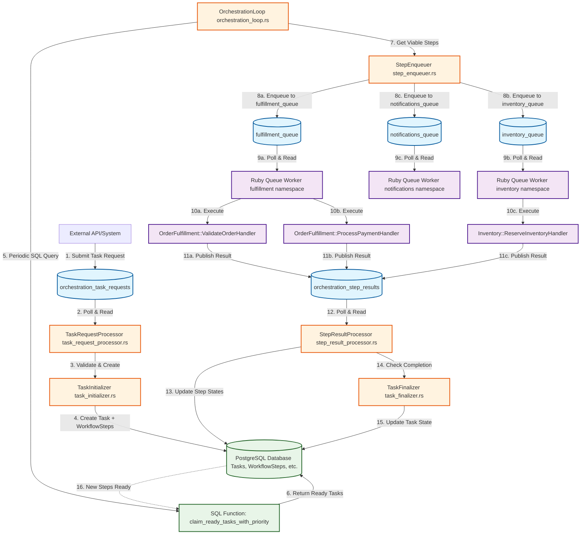

# Queue-Based Workflow Processing Architecture

## Overview

The Tasker Core orchestration system uses a PostgreSQL message queue (pgmq) based architecture for distributed task processing. This design eliminates FFI coupling, provides autonomous worker processing, and enables clean separation between orchestration (Rust) and execution (Ruby/other languages).

## Architecture Principles

- **SQL-Driven Task Discovery**: Tasks become ready through database state changes, not explicit enqueueing
- **Individual Step Processing**: Steps are processed one-by-one, not in batches, for better fault isolation
- **Autonomous Workers**: Workers poll queues independently without central coordination
- **Queue-First Communication**: All inter-component communication goes through PostgreSQL message queues
- **Stateless Processing**: Workers delete messages immediately after processing, no retry state management

## Core Queues

### Primary Orchestration Queues

1. **`orchestration_task_requests`** - Incoming task requests from external systems
2. **`orchestration_step_results`** - Step execution results from workers
3. **`{namespace}_queue`** - Per-namespace step execution queues (e.g., `fulfillment_queue`, `inventory_queue`)

## Complete Workflow Diagram



## Detailed Component Flow

### Phase 1: Task Request Processing

**Entry Point**: External systems submit task requests
**Queue**: `orchestration_task_requests`
**Components**:

- `TaskRequestProcessor` (`src/orchestration/task_request_processor.rs`)
- `TaskInitializer` (`src/orchestration/task_initializer.rs`)

```rust
// TaskRequestProcessor polling loop
pub async fn start_task_request_processing_loop(&self) -> Result<()> {
    loop {
        let messages = self.pgmq_client
            .read_messages(&self.config.request_queue_name, ...)
            .await?;

        for message in messages {
            self.process_task_request_message(&message).await?;
        }
    }
}
```

**Flow**:

1. TaskRequestProcessor polls `orchestration_task_requests` queue
2. Validates incoming TaskRequestMessage using TaskHandlerRegistry
3. Calls TaskInitializer.create_task_from_request()
4. TaskInitializer creates Task + WorkflowSteps in database
5. Task is now ready for SQL-based discovery (no enqueueing needed)

### Phase 2: Orchestration Loop - Task Discovery & Step Enqueueing

**Components**:

- `OrchestrationLoop` (`src/orchestration/orchestration_loop.rs`)
- `StepEnqueuer` (`src/orchestration/step_enqueuer.rs`)
- `ViableStepDiscovery` (`src/orchestration/viable_step_discovery.rs`)

```rust
// OrchestrationLoop claiming ready tasks
pub async fn run_continuous(&self) -> Result<ContinuousOrchestrationSummary> {
    loop {
        // SQL-based task discovery
        let claimed_tasks = self.sql_executor
            .claim_ready_tasks_with_priority(self.config.tasks_per_cycle, &self.orchestrator_id)
            .await?;

        // Enqueue steps for each claimed task
        for claimed_task in claimed_tasks {
            self.step_enqueuer.enqueue_ready_steps(&claimed_task).await?;
        }
    }
}
```

**Flow**:

1. OrchestrationLoop periodically calls SQL function `claim_ready_tasks_with_priority()`
2. SQL function returns tasks that have viable steps (dependencies satisfied, not in backoff)
3. For each claimed task, StepEnqueuer discovers viable steps using ViableStepDiscovery
4. Each viable step is enqueued to its namespace-specific queue (e.g., `fulfillment_queue`)
5. Step messages include full execution context: (task, sequence, step)

### Phase 3: Autonomous Worker Processing

**Components**: Ruby Queue Workers (`bindings/ruby/lib/tasker_core/messaging/queue_worker.rb`)
**Queues**: `{namespace}_queue` (e.g., `fulfillment_queue`, `inventory_queue`)

```ruby
# Ruby Queue Worker polling loop
def start_polling_loop
  loop do
    messages = @pgmq_client.read_step_messages(@namespace,
                                               visibility_timeout: 30,
                                               qty: @batch_size)

    messages.each do |message_data|
      process_step_message(message_data)
    end
  end
end

def process_step_message(message_data)
  step_message = message_data[:step_message]

  # Find appropriate handler
  handler = find_step_handler(step_message.namespace, step_message.step_name)

  # Execute step with (task, sequence, step) context
  result = handler.call(
    step_message.execution_context.task,
    step_message.execution_context.sequence,
    step_message.execution_context.step
  )

  # Publish result to orchestration_step_results queue
  publish_step_result(step_message, result)

  # Delete message immediately (no retry state management)
  @pgmq_client.delete_message(queue_name, message_data[:queue_message][:msg_id])
end
```

**Flow**:

1. Ruby workers poll their namespace queues autonomously
2. Workers read StepMessage with full execution context
3. Workers locate appropriate step handler for the step
4. Handler executes with (task, sequence, step) pattern
5. Any return value from handler is treated as success
6. Worker publishes StepResultMessage to `orchestration_step_results` queue
7. Worker immediately deletes processed message (immediate delete pattern)

### Phase 4: Step Result Processing & Task Finalization

**Components**:

- `StepResultProcessor` (`src/orchestration/step_result_processor.rs`)
- `OrchestrationResultProcessor` (`src/orchestration/result_processor.rs`)
- `TaskFinalizer` (`src/orchestration/task_finalizer.rs`)

```rust
// StepResultProcessor polling loop
pub async fn start_processing_loop(&self) -> Result<()> {
    loop {
        let messages = self.pgmq_client
            .read_messages(&self.config.step_results_queue_name, ...)
            .await?;

        for message in messages {
            self.process_single_step_result(&message.message, message.msg_id).await?;

            // Delete processed message
            self.pgmq_client
                .delete_message(&self.config.step_results_queue_name, message.msg_id)
                .await?;
        }
    }
}
```

**Flow**:

1. StepResultProcessor polls `orchestration_step_results` queue
2. Processes StepResultMessage including orchestration metadata
3. OrchestrationResultProcessor handles step state transitions
4. StateManager updates step status (completed/failed/etc.)
5. TaskFinalizer checks if task should be completed/failed
6. Updated step states make new steps viable automatically
7. Next orchestration cycle discovers newly ready steps via SQL

## Key Architectural Benefits

### SQL-Driven Task Readiness

Tasks become ready automatically when:

- Step completions satisfy dependencies for remaining steps
- Backoff periods expire (handled by SQL time-based queries)
- Error conditions are resolved

No explicit task reenqueuing needed - all handled by SQL discovery.

### Individual Step Processing

- **Better Fault Isolation**: One failed step doesn't affect others
- **Granular Control**: Each step processed independently with full context
- **Simplified Workers**: No batch coordination complexity
- **Immediate Feedback**: Step results processed as they complete

### Autonomous Worker Pattern

- **No Registration Required**: Workers start polling and processing independently
- **Language Agnostic**: Any language can implement the queue worker pattern
- **Stateless Debugging**: No worker state to manage, easier troubleshooting
- **Horizontal Scaling**: Add more workers by starting additional processes

### Enhanced Metadata Flow

```rust
pub struct OrchestrationMetadata {
    pub headers: HashMap<String, String>,           // HTTP headers for backoff hints
    pub error_context: Option<String>,              // Domain-specific error context
    pub backoff_hint: Option<BackoffHint>,          // Explicit backoff guidance
    // ...
}
```

Workers can provide rich metadata to orchestration for intelligent backoff decisions.

## Code Path Reference

### Rust Orchestration Core

| Component                    | File                                          | Purpose                                       |
| ---------------------------- | --------------------------------------------- | --------------------------------------------- |
| TaskRequestProcessor         | `src/orchestration/task_request_processor.rs` | Processes incoming task requests              |
| TaskInitializer              | `src/orchestration/task_initializer.rs`       | Creates tasks and workflow steps              |
| OrchestrationLoop            | `src/orchestration/orchestration_loop.rs`     | Main orchestration coordination               |
| StepEnqueuer                 | `src/orchestration/step_enqueuer.rs`          | Enqueues individual steps to namespace queues |
| StepResultProcessor          | `src/orchestration/step_result_processor.rs`  | Processes step execution results              |
| OrchestrationResultProcessor | `src/orchestration/result_processor.rs`       | Handles step state transitions and metadata   |
| TaskFinalizer                | `src/orchestration/task_finalizer.rs`         | Determines task completion                    |
| ViableStepDiscovery          | `src/orchestration/viable_step_discovery.rs`  | Discovers ready steps for claimed tasks       |

### Ruby Worker Implementation

| Component     | File                                                      | Purpose                                    |
| ------------- | --------------------------------------------------------- | ------------------------------------------ |
| QueueWorker   | `bindings/ruby/lib/tasker_core/messaging/queue_worker.rb` | Base worker polling and message processing |
| PgmqClient    | `bindings/ruby/lib/tasker_core/messaging/pgmq_client.rb`  | Ruby pgmq queue operations                 |
| StepMessage   | `bindings/ruby/lib/tasker_core/types/step_message.rb`     | Step message type definitions              |
| Step Handlers | `bindings/ruby/spec/handlers/examples/*/step_handlers/`   | Example business logic handlers            |

### Message Types

| Message Type       | File                                      | Purpose                              |
| ------------------ | ----------------------------------------- | ------------------------------------ |
| TaskRequestMessage | `src/messaging/orchestration_messages.rs` | Task requests from external systems  |
| StepMessage        | `src/messaging/message.rs`                | Individual step execution messages   |
| StepResultMessage  | `src/messaging/message.rs`                | Step execution results with metadata |

## Queue Management

### Queue Creation

Queues are created automatically by orchestration components:

```rust
// Task request queue
self.pgmq_client.create_queue("orchestration_task_requests").await?;

// Step results queue
self.pgmq_client.create_queue("orchestration_step_results").await?;

// Namespace queues
for namespace in &config.active_namespaces {
    self.pgmq_client.create_queue(&format!("{}_queue", namespace)).await?;
}
```

### Message Lifecycle

1. **Enqueue**: Messages added to queue with optional delay
2. **Read**: Messages become visible to consumers with visibility timeout
3. **Process**: Workers process messages and generate results
4. **Delete**: Successfully processed messages deleted immediately
5. **Archive**: Failed messages archived for analysis

## Configuration

### Orchestration System Config

```yaml
orchestration:
  task_requests_queue_name: "orchestration_task_requests"
  orchestrator_id: "orchestrator-1"
  active_namespaces:
    - "fulfillment"
    - "inventory"
    - "notifications"
    - "payments"
    - "analytics"
  orchestration_loop_config:
    tasks_per_cycle: 10
    cycle_interval_seconds: 1
```

### Queue Worker Config

```ruby
# Ruby worker configuration
TaskerCore::Messaging.create_queue_worker(
  "fulfillment",
  poll_interval: 1.0,
  batch_size: 5,
  visibility_timeout: 300
)
```

## Monitoring & Observability

### Queue Metrics

- Queue lengths and message counts
- Processing rates and throughput
- Error rates and failure patterns
- Worker health and availability

### Orchestration Metrics

- Tasks processed per cycle
- Step enqueueing rates
- Task completion times
- Priority distribution

### Worker Metrics

- Messages processed per worker
- Step execution times
- Handler success/failure rates
- Namespace-specific performance

## Future Enhancements

### Multi-Language Worker Support

The queue-based architecture enables workers in any language:

- **Python**: Using `asyncpg` or `psycopg2` for queue operations
- **Node.js**: Using `pg` package for PostgreSQL integration
- **Go**: Using `pgx` driver for high-performance processing
- **Java**: Using JDBC for enterprise integration

### Advanced Routing

- Priority-based step routing
- Affinity-based worker assignment
- Resource-aware load balancing
- Circuit breaker patterns

### Enhanced Monitoring

- Real-time queue visualization
- Distributed tracing integration
- Performance anomaly detection
- Capacity planning metrics

---

This queue-based architecture provides a robust, scalable foundation for distributed workflow orchestration while maintaining clean separation of concerns and enabling autonomous, fault-tolerant processing across multiple languages and deployment environments.
