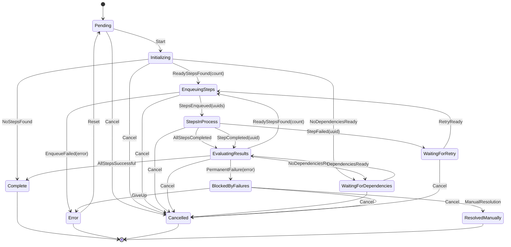
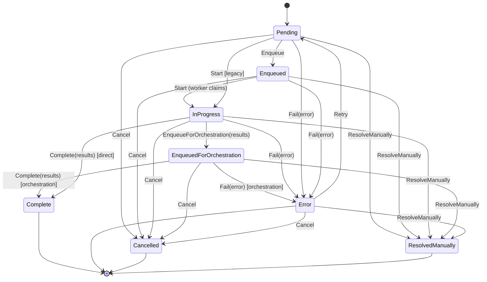

# States and Lifecycles

This document provides comprehensive documentation of the state machine architecture in tasker-core, covering both task and workflow step lifecycles, their state transitions, and the underlying persistence mechanisms.

## Overview

The tasker-core system implements a sophisticated dual-state-machine architecture:

1. **Task State Machine**: Manages overall workflow orchestration with 12 comprehensive states (TAS-41 enhancement)
2. **Workflow Step State Machine**: Manages individual step execution with 8 states including orchestration queuing

Both state machines work in coordination to provide atomic, auditable, and resilient workflow execution with proper event-driven communication between orchestration and worker systems.

## Task State Machine Architecture

### Task State Definitions

The task state machine implements 12 comprehensive states as defined in `tasker-shared/src/state_machine/states.rs`:

#### Initial States
- **`Pending`**: Created but not started (default initial state)
- **`Initializing`**: Discovering initial ready steps and setting up task context

#### Active Processing States  
- **`EnqueuingSteps`**: Actively enqueuing ready steps to worker queues
- **`StepsInProcess`**: Steps are being processed by workers (orchestration monitoring)
- **`EvaluatingResults`**: Processing results from completed steps and determining next actions

#### Waiting States
- **`WaitingForDependencies`**: No ready steps, waiting for dependencies to be satisfied
- **`WaitingForRetry`**: Waiting for retry timeout before attempting failed steps again
- **`BlockedByFailures`**: Has failures that prevent progress (manual intervention may be needed)

#### Terminal States
- **`Complete`**: All steps completed successfully (terminal)
- **`Error`**: Task failed permanently (terminal)
- **`Cancelled`**: Task was cancelled (terminal)
- **`ResolvedManually`**: Manually resolved by operator (terminal)

### Task State Properties

Each state has key properties that drive system behavior:

```rust
impl TaskState {
    pub fn is_terminal(&self) -> bool         // Cannot transition further
    pub fn requires_ownership(&self) -> bool  // Processor ownership required
    pub fn is_active(&self) -> bool          // Currently being processed  
    pub fn is_waiting(&self) -> bool         // Waiting for external conditions
    pub fn can_be_processed(&self) -> bool   // Available for orchestration pickup
}
```

**Ownership-Required States**: `Initializing`, `EnqueuingSteps`, `StepsInProcess`, `EvaluatingResults`
**Processable States**: `Pending`, `WaitingForDependencies`, `WaitingForRetry`

### Task Lifecycle Flow



### Task Event System

Task state transitions are driven by events defined in `tasker-shared/src/state_machine/events.rs`:

#### Lifecycle Events
- `Start`: Begin task processing
- `Cancel`: Cancel task execution
- `GiveUp`: Abandon task (BlockedByFailures -> Error)
- `ManualResolution`: Manually resolve task

#### Discovery Events  
- `ReadyStepsFound(count)`: Ready steps discovered during initialization/evaluation
- `NoStepsFound`: No steps defined - task can complete immediately
- `NoDependenciesReady`: Dependencies not satisfied - wait required
- `DependenciesReady`: Dependencies now ready - can proceed

#### Processing Events
- `StepsEnqueued(vec<Uuid>)`: Steps successfully queued for workers  
- `EnqueueFailed(error)`: Failed to enqueue steps
- `StepCompleted(uuid)`: Individual step completed
- `StepFailed(uuid)`: Individual step failed
- `AllStepsCompleted`: All current batch steps finished
- `AllStepsSuccessful`: All steps completed successfully

#### System Events
- `PermanentFailure(error)`: Unrecoverable failure
- `RetryReady`: Retry timeout expired
- `Timeout`: Operation timeout occurred
- `ProcessorCrashed`: Processor became unavailable

### Processor Ownership (TAS-41)

The task state machine implements processor ownership for active states to prevent race conditions:

```rust
// Ownership validation in task_state_machine.rs
if target_state.requires_ownership() {
    let current_processor = self.get_current_processor().await?;
    TransitionGuard::check_ownership(target_state, current_processor, self.processor_uuid)?;
}
```

**Ownership Rules**:
- States requiring ownership: `Initializing`, `EnqueuingSteps`, `StepsInProcess`, `EvaluatingResults`
- Processor UUID stored in `tasker_task_transitions.processor_uuid` column
- Atomic ownership claiming prevents concurrent processing
- Ownership validated on each transition attempt

## Workflow Step State Machine Architecture

### Step State Definitions

The workflow step state machine implements 8 states for individual step execution:

#### Processing Pipeline States
- **`Pending`**: Initial state when step is created
- **`Enqueued`**: Queued for processing but not yet claimed by worker
- **`InProgress`**: Currently being executed by a worker
- **`EnqueuedForOrchestration`**: Worker completed, queued for orchestration processing

#### Terminal States
- **`Complete`**: Step completed successfully (after orchestration processing)
- **`Error`**: Step failed with an error (after orchestration processing)  
- **`Cancelled`**: Step was cancelled
- **`ResolvedManually`**: Step was manually resolved by operator

### Step State Properties

```rust
impl WorkflowStepState {
    pub fn is_terminal(&self) -> bool                    // No further transitions
    pub fn is_error(&self) -> bool                       // In error state (may allow retry)
    pub fn is_active(&self) -> bool                      // Being processed by worker
    pub fn is_in_processing_pipeline(&self) -> bool     // In execution pipeline
    pub fn is_ready_for_claiming(&self) -> bool         // Available for worker claim
    pub fn satisfies_dependencies(&self) -> bool        // Can satisfy other step dependencies
}
```

### Step Lifecycle Flow



### Step Event System

Step transitions are driven by `StepEvent` types:

#### Processing Events
- `Enqueue`: Queue step for worker processing
- `Start`: Begin step execution (worker claims step)
- `EnqueueForOrchestration(results)`: Worker completes, queues for orchestration
- `Complete(results)`: Mark step complete (from orchestration or legacy direct)
- `Fail(error)`: Mark step as failed

#### Control Events  
- `Cancel`: Cancel step execution
- `ResolveManually`: Manual operator resolution
- `Retry`: Retry step from error state

### Step Execution Flow Integration

The step state machine integrates tightly with the task state machine:

1. **Task Discovers Ready Steps**: `TaskEvent::ReadyStepsFound(count)` -> Task moves to `EnqueuingSteps`
2. **Steps Get Enqueued**: `StepEvent::Enqueue` -> Steps move to `Enqueued` state
3. **Workers Claim Steps**: `StepEvent::Start` -> Steps move to `InProgress`
4. **Workers Complete Steps**: `StepEvent::EnqueueForOrchestration(results)` -> Steps move to `EnqueuedForOrchestration`
5. **Orchestration Processes Results**: `StepEvent::Complete(results)` -> Steps move to `Complete`
6. **Task Evaluates Progress**: `TaskEvent::StepCompleted(uuid)` -> Task moves to `EvaluatingResults`
7. **Task Completes or Continues**: Based on remaining steps -> Task moves to `Complete` or back to `EnqueuingSteps`

## Guard Conditions and Validation

Both state machines implement comprehensive guard conditions in `tasker-shared/src/state_machine/guards.rs`:

### Task Guards

#### TransitionGuard
- Validates all task state transitions
- Prevents invalid state combinations
- Enforces terminal state immutability
- Supports legacy transition compatibility

#### Ownership Validation
- Checks processor ownership for ownership-required states
- Prevents concurrent task processing
- Allows ownership claiming for unowned tasks

### Step Guards

#### StepDependenciesMetGuard
- Validates all step dependencies are satisfied
- Delegates to `WorkflowStep::dependencies_met()`
- Prevents premature step execution

#### StepNotInProgressGuard  
- Ensures step is not already being processed
- Prevents duplicate worker claims
- Validates step availability

#### Retry Guards
- `StepCanBeRetriedGuard`: Validates step is in Error state
- Checks retry limits and conditions
- Prevents infinite retry loops

#### Orchestration Guards
- `StepCanBeEnqueuedForOrchestrationGuard`: Step must be InProgress
- `StepCanBeCompletedFromOrchestrationGuard`: Step must be EnqueuedForOrchestration
- `StepCanBeFailedFromOrchestrationGuard`: Step must be EnqueuedForOrchestration

## Persistence Layer Architecture

### Delegation Pattern

The persistence layer in `tasker-shared/src/state_machine/persistence.rs` implements a delegation pattern to the model layer:

```rust
// TaskTransitionPersistence -> TaskTransition::create() & TaskTransition::get_current()
// StepTransitionPersistence -> WorkflowStepTransition::create() & WorkflowStepTransition::get_current()
```

**Benefits**:
- No SQL duplication between state machine and models
- Atomic transaction handling in models
- Single source of truth for database operations
- Independent testability of model methods

### Transition Storage

#### Task Transitions (`tasker_task_transitions`)
```sql
CREATE TABLE tasker_task_transitions (
  task_transition_uuid UUID PRIMARY KEY DEFAULT uuid_generate_v7(),
  task_uuid UUID NOT NULL,
  to_state VARCHAR NOT NULL,
  from_state VARCHAR,
  processor_uuid UUID,           -- TAS-41: Ownership tracking
  metadata JSONB,
  sort_key INTEGER NOT NULL,
  most_recent BOOLEAN DEFAULT false,
  created_at TIMESTAMP NOT NULL DEFAULT CURRENT_TIMESTAMP,
  updated_at TIMESTAMP NOT NULL DEFAULT CURRENT_TIMESTAMP
);
```

#### Step Transitions (`tasker_workflow_step_transitions`)  
```sql
CREATE TABLE tasker_workflow_step_transitions (
  workflow_step_transition_uuid UUID PRIMARY KEY DEFAULT uuid_generate_v7(),
  workflow_step_uuid UUID NOT NULL,
  to_state VARCHAR NOT NULL,
  from_state VARCHAR,
  metadata JSONB,
  sort_key INTEGER NOT NULL,
  most_recent BOOLEAN DEFAULT false,
  created_at TIMESTAMP NOT NULL DEFAULT CURRENT_TIMESTAMP,
  updated_at TIMESTAMP NOT NULL DEFAULT CURRENT_TIMESTAMP
);
```

### Current State Resolution

Both transition models implement efficient current state resolution:

```rust
// O(1) current state lookup using most_recent flag
TaskTransition::get_current(pool, task_uuid) -> Option<TaskTransition>
WorkflowStepTransition::get_current(pool, step_uuid) -> Option<WorkflowStepTransition>
```

**Performance Optimization**:
- `most_recent = true` flag on latest transition only
- Indexed queries: `(task_uuid, most_recent) WHERE most_recent = true`
- Atomic flag updates during transition creation

### Atomic Transitions with Ownership

TAS-41 introduced atomic transitions with processor ownership:

```rust
impl TaskTransitionPersistence {
    pub async fn transition_with_ownership(
        &self,
        task_uuid: Uuid,
        from_state: TaskState,
        to_state: TaskState, 
        processor_uuid: Uuid,
        metadata: Option<Value>,
        pool: &PgPool,
    ) -> PersistenceResult<bool>
}
```

**Atomicity Guarantees**:
- Single database transaction for state change
- Processor UUID stored in dedicated column
- `most_recent` flag updated atomically
- Race condition prevention through database constraints

## Action System

Both state machines execute actions after successful transitions:

### Task Actions
1. **PublishTransitionEventAction**: Publishes task state change events
2. **UpdateTaskCompletionAction**: Updates task completion status
3. **ErrorStateCleanupAction**: Performs error state cleanup

### Step Actions  
1. **PublishTransitionEventAction**: Publishes step state change events
2. **UpdateStepResultsAction**: Updates step results and execution data
3. **TriggerStepDiscoveryAction**: Triggers task-level step discovery
4. **ErrorStateCleanupAction**: Performs step error cleanup

Actions execute sequentially after transition persistence, ensuring consistency.

## State Machine Integration Points

### Task <-> Step Coordination

1. **Step Discovery**: Task initialization discovers ready steps
2. **Step Enqueueing**: Task enqueues discovered steps to worker queues  
3. **Progress Monitoring**: Task monitors step completion via events
4. **Result Processing**: Task processes step results and discovers next steps
5. **Completion Detection**: Task completes when all steps are complete

### Event-Driven Communication

- **pg_notify**: PostgreSQL notifications for real-time coordination
- **Event Publishers**: Publish state transition events to event system
- **Event Subscribers**: React to state changes across system boundaries
- **Queue Integration**: PGMQ message queues for worker communication

### Worker Integration

- **Step Claiming**: Workers claim `Enqueued` steps from queues
- **Progress Updates**: Workers transition steps to `InProgress` 
- **Result Submission**: Workers submit results via `EnqueueForOrchestration`
- **Orchestration Processing**: Orchestration processes results and completes steps

This sophisticated state machine architecture provides the foundation for reliable, auditable, and scalable workflow orchestration in the tasker-core system.