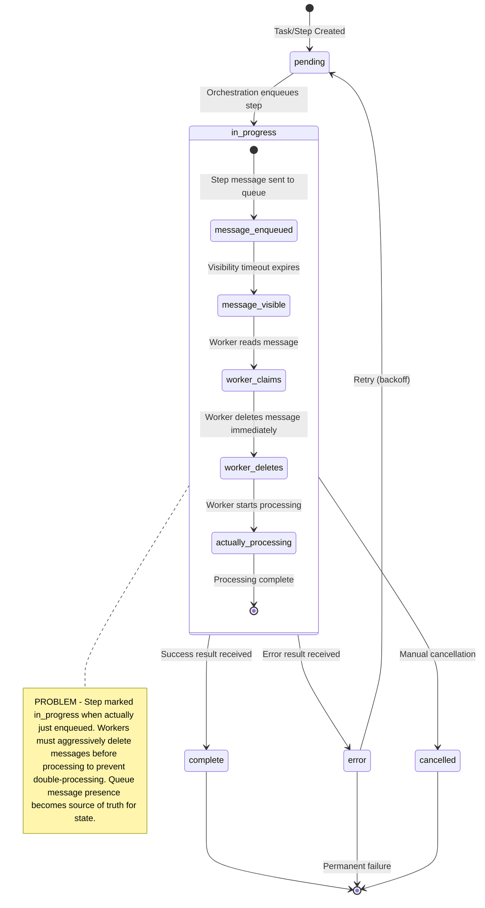
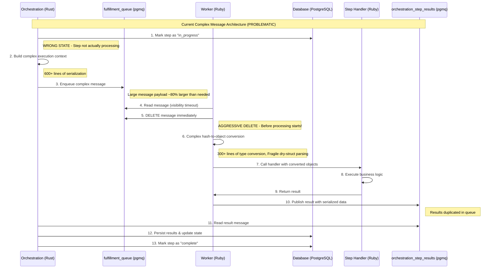
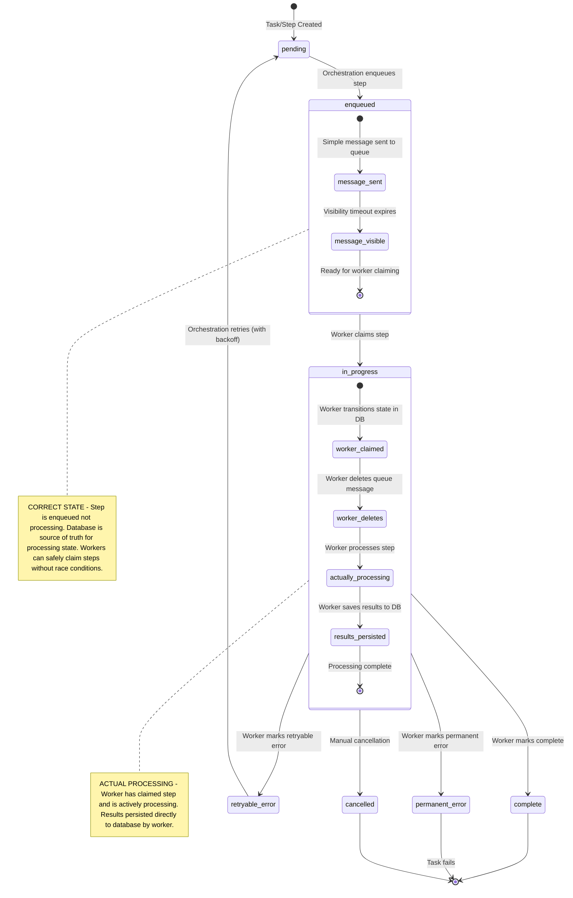
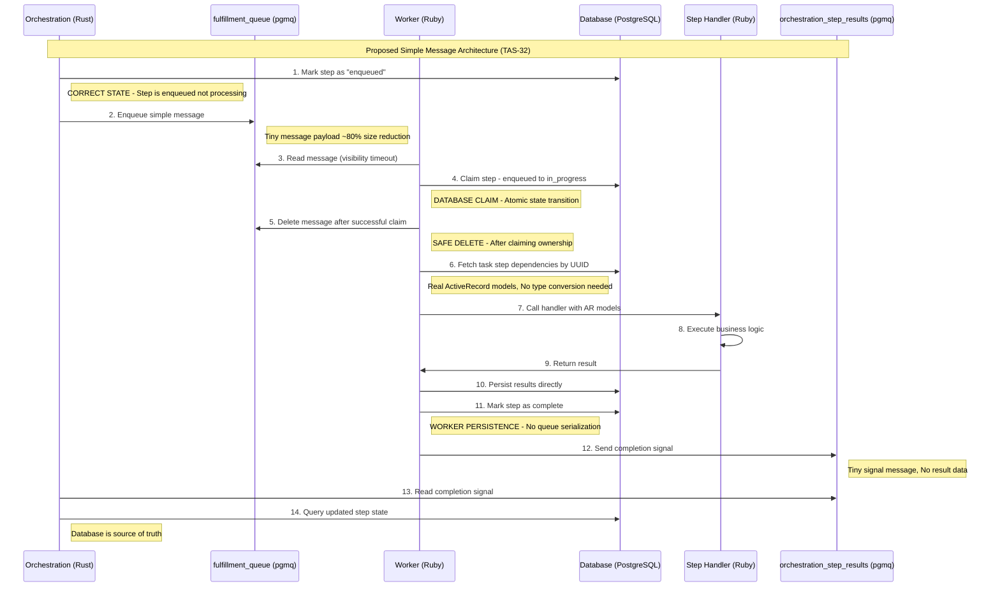

# TAS-32 Supplemental: Visual Architecture Comparison

This document provides visual diagrams comparing the current queue-based workflow processing with the proposed TAS-32 improvements for queue state management.

## Current Architecture (Problem State)

### Current Workflow State Diagram

### Current Message Flow (Complex Messages)

### Current Architecture Issues

#### State Management Problems
1. **Misleading State**: Steps marked `in_progress` when only `enqueued`
2. **Queue as State Source**: Message presence indicates processing state
3. **Race Conditions**: Multiple workers can claim if deletion fails
4. **Aggressive Deletion**: Messages deleted before processing starts

#### Message Complexity Issues
1. **Large Payloads**: 600+ lines of complex serialization
2. **Type Conversion**: Hash-to-object transformation fragility
3. **Duplicated Data**: Results serialized in both database and queue
4. **Complex Dependencies**: Nested execution context serialization

---

## Proposed Architecture (TAS-32 Solution)

### Proposed Workflow State Diagram

### Proposed Message Flow (Simple Messages)

---

## State Comparison Table

| Aspect | Current (Problematic) | Proposed (TAS-32) |
|--------|----------------------|-------------------|
| **Orchestration Transition** | `pending → in_progress` | `pending → enqueued` |
| **Worker Transition** | None (already "in_progress") | `enqueued → in_progress` |
| **State Source of Truth** | Queue message presence | Database state |
| **Message Size** | Large (complex context) | Small (3 UUIDs) |
| **Data Fetching** | Serialized in message | ActiveRecord queries |
| **Result Persistence** | Orchestration handles | Worker handles directly |
| **Idempotency** | Race conditions possible | Database-enforced |
| **Message Deletion** | Before processing | After claiming |

---

## Key Architectural Benefits

### 1. Proper State Semantics
- **Current**: "in_progress" means "enqueued" (confusing)
- **Proposed**: "enqueued" means "enqueued", "in_progress" means "processing"

### 2. Idempotency Guarantee
- **Current**: Queue message presence determines eligibility
- **Proposed**: Database state determines eligibility (atomic)

### 3. Simplified Messages
- **Current**: Complex nested JSON with execution context
- **Proposed**: Simple 3-UUID structure (80% size reduction)

### 4. ActiveRecord Integration  
- **Current**: Hash-to-object conversion fragility
- **Proposed**: Real ActiveRecord models with full ORM functionality

### 5. Clear Responsibility
- **Current**: Orchestration handles result persistence
- **Proposed**: Workers handle their own result persistence

---

## Implementation Impact Analysis

### Code Reduction Estimates

| Component | Current Lines | Proposed Lines | Reduction |
|-----------|---------------|----------------|-----------|
| **Ruby Message Processing** | ~825 lines | ~300 lines | ~525 lines |
| **Ruby Step Message Types** | ~525 lines | ~150 lines | ~375 lines |
| **Ruby Handler Registry** | ~271 lines | ~100 lines | ~171 lines |
| **Rust Message Creation** | ~300 lines | ~100 lines | ~200 lines |
| **Total** | ~1,921 lines | ~650 lines | **~1,271 lines** |

### Performance Benefits

1. **Message Size**: 80% reduction (3 UUIDs vs complex JSON)
2. **Serialization**: Eliminated complex object serialization
3. **Database Queries**: Efficient UUID lookups with proper indexes
4. **Memory Usage**: No complex object graphs in messages
5. **Network Overhead**: Smaller message payloads

### Risk Mitigation

1. **Database Load**: Offset by eliminating complex serialization
2. **Query Efficiency**: UUID indexes provide fast lookups
3. **ActiveRecord Queries**: Can use includes/joins for efficient loading
4. **Stale Messages**: UUID-based lookup prevents processing wrong records

---

## Testing Strategy

### Integration Test Updates Required

1. **State Transition Tests**: Verify `pending → enqueued → in_progress` flow
2. **Message Format Tests**: Update for simple UUID-based messages
3. **Handler Tests**: Verify handlers work with ActiveRecord models
4. **Idempotency Tests**: Verify multiple workers cannot claim same step
5. **Error Handling Tests**: Verify graceful handling of missing records

### Success Criteria

1. ✅ All existing workflow integration tests pass
2. ✅ Message payload size reduced by >80%
3. ✅ No race conditions in step claiming
4. ✅ Handlers receive proper ActiveRecord models
5. ✅ End-to-end workflow completion works reliably

---

This architectural change addresses the core issues identified in TAS-32 while maintaining compatibility with existing handler interfaces and dramatically simplifying the message processing pipeline.