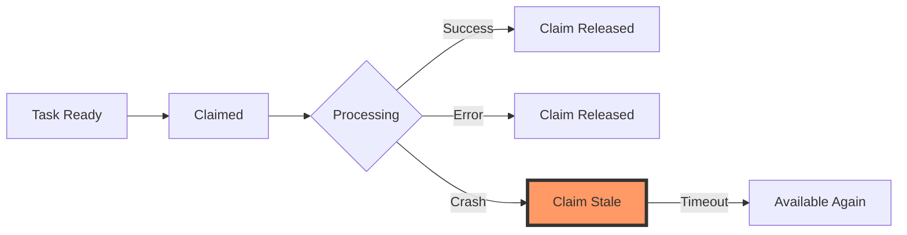

# TAS-39: Stale Task Claim Monitoring View

## Problem Statement

Our task claiming system is designed for rapid, short-lived claims:
- **Step enqueuing claims**: Should complete within 5-30 seconds (typical claim_timeout_seconds: 60)
- **Finalization claims**: Should complete within 30 seconds (per TAS-37 implementation)

However, we currently lack visibility into claims that exceed these expected durations, which can indicate:
- Processor crashes mid-claim
- Deadlocks or infinite loops in processing logic
- Network partitions preventing claim release
- Database connection issues
- Tasks stuck in impossible states

Without proper monitoring, these stale claims can lead to:
- Tasks appearing "stuck" with no progress
- Reduced system throughput as tasks remain unnecessarily claimed
- Difficult debugging when issues arise
- Silent failures that go unnoticed until user complaints

## Current State Analysis

### Existing Infrastructure

#### 1. Task Claiming Mechanisms
- **`claim_ready_tasks()`**: Claims tasks for step enqueuing with configurable timeout
- **`claim_task_for_finalization()`**: Claims tasks for finalization (TAS-37)
- **`release_task_claim()`**: Releases step enqueuing claims
- **`release_finalization_claim()`**: Releases finalization claims

#### 2. Claim Storage
```sql
-- In tasker_tasks table:
claimed_at timestamp(6),           -- When claim was acquired
claimed_by character varying,      -- Processor ID that holds claim
claim_timeout_seconds integer,     -- Expected timeout duration
```

#### 3. Existing Monitoring
- **`tasker_ready_tasks` view**: Shows tasks ready for processing
- **`tasker_finalization_attempts` table**: Audit log of finalization attempts (TAS-37)
- **No view for stale claims**: Gap in monitoring infrastructure

### Claim Lifecycle Analysis



The critical gap is visibility into state F (Claim Stale) before automatic timeout.

## Proposed Solution

Create a comprehensive stale claim monitoring system with:

1. **Core View**: `tasker_stale_claims` - Real-time view of potentially stuck claims
2. **Historical Table**: `tasker_stale_claim_events` - Audit log of all stale claim occurrences
3. **Summary View**: `tasker_claim_health_summary` - Aggregated health metrics
4. **Alert Functions**: SQL functions to support monitoring systems

### Design Principles

- **Early Warning**: Detect stale claims before they timeout
- **Root Cause Analysis**: Include context for debugging
- **Performance**: Efficient queries that don't impact production
- **Actionable**: Provide clear signals for intervention

## Implementation

### Phase 1: Core Stale Claims View

```sql
-- Migration: 20250819000001_add_stale_claim_monitoring.sql

-- Core view for monitoring stale task claims
CREATE OR REPLACE VIEW public.tasker_stale_claims AS
WITH claim_analysis AS (
    SELECT
        t.task_uuid,
        t.claimed_by,
        t.claimed_at,
        t.claim_timeout_seconds,
        t.priority,
        t.complete,
        nt.name as task_name,
        tn.name as namespace_name,

        -- Calculate claim age and staleness
        EXTRACT(EPOCH FROM (NOW() - t.claimed_at)) AS claim_age_seconds,
        EXTRACT(EPOCH FROM (NOW() - t.claimed_at)) / 60.0 AS claim_age_minutes,

        -- Determine expected claim duration based on context
        CASE
            -- Finalization claims should be very quick
            WHEN EXISTS (
                SELECT 1 FROM tasker_finalization_attempts fa
                WHERE fa.task_uuid = t.task_uuid
                AND fa.processor_id = t.claimed_by
                AND fa.attempted_at >= t.claimed_at - INTERVAL '1 second'
            ) THEN 30  -- Finalization expected in 30s

            -- High priority tasks should process faster
            WHEN t.priority >= 4 THEN 30
            WHEN t.priority = 3 THEN 45
            ELSE 60  -- Normal tasks
        END AS expected_duration_seconds,

        -- Get task execution context
        tec.execution_status,
        tec.ready_steps,
        tec.in_progress_steps,
        tec.completed_steps,
        tec.failed_steps,
        tec.total_steps,

        -- Check for recent activity
        (SELECT MAX(ws.updated_at)
         FROM tasker_workflow_steps ws
         WHERE ws.task_uuid = t.task_uuid) AS last_step_activity,

        -- Count recent step state changes
        (SELECT COUNT(*)
         FROM tasker_workflow_steps ws
         WHERE ws.task_uuid = t.task_uuid
         AND ws.updated_at > t.claimed_at) AS steps_updated_since_claim,

        -- Check if processor still exists in recent claims
        (SELECT COUNT(DISTINCT task_uuid)
         FROM tasker_tasks t2
         WHERE t2.claimed_by = t.claimed_by
         AND t2.claimed_at > NOW() - INTERVAL '5 minutes'
         AND t2.task_uuid != t.task_uuid) AS other_recent_claims_by_processor
    FROM tasker_tasks t
    JOIN tasker_named_tasks nt ON t.named_task_uuid = nt.named_task_uuid
    JOIN tasker_task_namespaces tn ON nt.task_namespace_uuid = tn.task_namespace_uuid
    LEFT JOIN LATERAL (
        SELECT * FROM get_task_execution_context(t.task_uuid)
    ) tec ON true
    WHERE t.claimed_at IS NOT NULL
      AND t.claimed_by IS NOT NULL
      AND t.complete = false
)
SELECT
    task_uuid,
    task_name,
    namespace_name,
    claimed_by,
    claimed_at,
    claim_age_minutes,
    claim_age_seconds,
    expected_duration_seconds,
    claim_timeout_seconds,

    -- Staleness classification
    CASE
        WHEN claim_age_seconds > claim_timeout_seconds THEN 'expired'
        WHEN claim_age_seconds > expected_duration_seconds * 2 THEN 'critical'
        WHEN claim_age_seconds > expected_duration_seconds * 1.5 THEN 'warning'
        WHEN claim_age_seconds > expected_duration_seconds THEN 'slow'
        ELSE 'normal'
    END AS staleness_level,

    -- Time until timeout
    GREATEST(0, claim_timeout_seconds - claim_age_seconds) AS seconds_until_timeout,

    -- Processor health indicator
    CASE
        WHEN other_recent_claims_by_processor > 0 THEN 'active'
        WHEN claim_age_seconds > 300 THEN 'missing'  -- No activity for 5 min
        ELSE 'unknown'
    END AS processor_status,

    -- Task state
    execution_status,
    ready_steps,
    in_progress_steps,
    completed_steps,
    failed_steps,
    total_steps,

    -- Activity indicators
    last_step_activity,
    steps_updated_since_claim,
    CASE
        WHEN steps_updated_since_claim > 0 THEN 'active'
        WHEN last_step_activity > claimed_at THEN 'recent'
        ELSE 'stalled'
    END AS task_activity_status,

    -- Diagnostic hints
    CASE
        WHEN claim_age_seconds > claim_timeout_seconds THEN
            'Claim has expired and should have been released'
        WHEN other_recent_claims_by_processor = 0 AND claim_age_seconds > 120 THEN
            'Processor appears to be down or disconnected'
        WHEN steps_updated_since_claim = 0 AND claim_age_seconds > expected_duration_seconds THEN
            'No progress detected since claim was acquired'
        WHEN execution_status IN ('failed', 'complete') THEN
            'Task in terminal state but still claimed'
        WHEN ready_steps = 0 AND in_progress_steps = 0 AND failed_steps = 0 THEN
            'Task has no actionable steps but remains claimed'
        ELSE NULL
    END AS diagnostic_hint,

    priority
FROM claim_analysis
WHERE claim_age_seconds > 60  -- Only show claims older than 1 minute
ORDER BY
    CASE staleness_level
        WHEN 'expired' THEN 1
        WHEN 'critical' THEN 2
        WHEN 'warning' THEN 3
        WHEN 'slow' THEN 4
        ELSE 5
    END,
    claim_age_seconds DESC;

-- Index to support the view
CREATE INDEX IF NOT EXISTS idx_tasker_tasks_stale_claims
ON tasker_tasks(claimed_at, claimed_by, complete)
WHERE claimed_at IS NOT NULL AND complete = false;

COMMENT ON VIEW tasker_stale_claims IS
'Monitor task claims that exceed expected processing duration. Acts as a dead letter queue (DLQ) for stuck claims.';
```

### Phase 2: Historical Tracking Table

```sql
-- Table to track stale claim events for trend analysis
CREATE TABLE IF NOT EXISTS public.tasker_stale_claim_events (
    id BIGSERIAL PRIMARY KEY,
    task_uuid uuid NOT NULL,
    claimed_by character varying NOT NULL,
    claimed_at timestamp NOT NULL,
    detected_at timestamp NOT NULL DEFAULT NOW(),
    claim_age_seconds integer NOT NULL,
    staleness_level character varying NOT NULL,
    processor_status character varying,
    task_activity_status character varying,
    execution_status character varying,
    diagnostic_hint text,
    resolution character varying, -- 'timeout', 'manual_release', 'completed', 'crashed'
    resolved_at timestamp,
    notes text
);

CREATE INDEX idx_stale_claim_events_task ON tasker_stale_claim_events(task_uuid, detected_at DESC);
CREATE INDEX idx_stale_claim_events_processor ON tasker_stale_claim_events(claimed_by, detected_at DESC);
CREATE INDEX idx_stale_claim_events_unresolved ON tasker_stale_claim_events(resolved_at) WHERE resolved_at IS NULL;

-- Function to capture stale claims periodically
CREATE OR REPLACE FUNCTION public.capture_stale_claims()
RETURNS void
LANGUAGE plpgsql
AS $$
BEGIN
    -- Insert new stale claims not yet tracked
    INSERT INTO tasker_stale_claim_events (
        task_uuid,
        claimed_by,
        claimed_at,
        claim_age_seconds,
        staleness_level,
        processor_status,
        task_activity_status,
        execution_status,
        diagnostic_hint
    )
    SELECT
        sc.task_uuid,
        sc.claimed_by,
        sc.claimed_at,
        sc.claim_age_seconds,
        sc.staleness_level,
        sc.processor_status,
        sc.task_activity_status,
        sc.execution_status,
        sc.diagnostic_hint
    FROM tasker_stale_claims sc
    WHERE sc.staleness_level IN ('warning', 'critical', 'expired')
    AND NOT EXISTS (
        SELECT 1
        FROM tasker_stale_claim_events sce
        WHERE sce.task_uuid = sc.task_uuid
        AND sce.claimed_by = sc.claimed_by
        AND sce.claimed_at = sc.claimed_at
        AND sce.resolved_at IS NULL
    );

    -- Mark resolved claims
    UPDATE tasker_stale_claim_events sce
    SET
        resolved_at = NOW(),
        resolution = CASE
            WHEN t.complete = true THEN 'completed'
            WHEN t.claimed_by IS NULL THEN 'released'
            WHEN t.claimed_by != sce.claimed_by THEN 'reclaimed'
            ELSE 'unknown'
        END
    FROM tasker_tasks t
    WHERE sce.task_uuid = t.task_uuid
    AND sce.resolved_at IS NULL
    AND (
        t.claimed_by IS NULL
        OR t.claimed_by != sce.claimed_by
        OR t.complete = true
    );
END;
$$;

COMMENT ON FUNCTION capture_stale_claims IS
'Captures stale claim events for historical tracking. Should be called periodically (e.g., every minute) by a monitoring job.';
```

### Phase 3: Health Summary View

```sql
-- Aggregated view for dashboards and alerts
CREATE OR REPLACE VIEW public.tasker_claim_health_summary AS
WITH current_stats AS (
    SELECT
        COUNT(*) FILTER (WHERE staleness_level = 'expired') AS expired_claims,
        COUNT(*) FILTER (WHERE staleness_level = 'critical') AS critical_claims,
        COUNT(*) FILTER (WHERE staleness_level = 'warning') AS warning_claims,
        COUNT(*) FILTER (WHERE staleness_level = 'slow') AS slow_claims,
        COUNT(DISTINCT claimed_by) AS unique_processors_with_stale_claims,
        MAX(claim_age_minutes) AS oldest_claim_minutes,
        AVG(claim_age_seconds) AS avg_stale_claim_age_seconds
    FROM tasker_stale_claims
),
historical_stats AS (
    SELECT
        COUNT(*) AS stale_events_last_hour,
        COUNT(DISTINCT task_uuid) AS unique_tasks_affected,
        COUNT(*) FILTER (WHERE resolved_at IS NULL) AS unresolved_events,
        AVG(EXTRACT(EPOCH FROM (COALESCE(resolved_at, NOW()) - detected_at))) AS avg_resolution_time_seconds
    FROM tasker_stale_claim_events
    WHERE detected_at > NOW() - INTERVAL '1 hour'
),
processor_health AS (
    SELECT
        COUNT(DISTINCT claimed_by) FILTER (WHERE processor_status = 'missing') AS missing_processors,
        COUNT(DISTINCT claimed_by) FILTER (WHERE processor_status = 'active') AS active_processors
    FROM tasker_stale_claims
)
SELECT
    NOW() AS report_time,

    -- Current state
    COALESCE(cs.expired_claims, 0) AS expired_claims,
    COALESCE(cs.critical_claims, 0) AS critical_claims,
    COALESCE(cs.warning_claims, 0) AS warning_claims,
    COALESCE(cs.slow_claims, 0) AS slow_claims,
    COALESCE(cs.expired_claims + cs.critical_claims + cs.warning_claims + cs.slow_claims, 0) AS total_stale_claims,

    -- Processor health
    COALESCE(ph.missing_processors, 0) AS missing_processors,
    COALESCE(ph.active_processors, 0) AS active_processors_with_stale_claims,
    COALESCE(cs.unique_processors_with_stale_claims, 0) AS total_processors_with_stale_claims,

    -- Timing stats
    COALESCE(cs.oldest_claim_minutes, 0) AS oldest_claim_minutes,
    COALESCE(cs.avg_stale_claim_age_seconds, 0) AS avg_stale_claim_age_seconds,

    -- Historical context
    COALESCE(hs.stale_events_last_hour, 0) AS stale_events_last_hour,
    COALESCE(hs.unique_tasks_affected, 0) AS unique_tasks_affected_last_hour,
    COALESCE(hs.unresolved_events, 0) AS unresolved_stale_events,
    COALESCE(hs.avg_resolution_time_seconds, 0) AS avg_resolution_time_seconds,

    -- Health score (0-100, higher is better)
    GREATEST(0,
        100 -
        (COALESCE(cs.expired_claims, 0) * 20) -  -- Heavy penalty for expired
        (COALESCE(cs.critical_claims, 0) * 10) -  -- Moderate penalty for critical
        (COALESCE(cs.warning_claims, 0) * 5) -    -- Light penalty for warnings
        (COALESCE(ph.missing_processors, 0) * 15) -- Penalty for missing processors
    ) AS health_score,

    -- Alert level
    CASE
        WHEN COALESCE(cs.expired_claims, 0) > 0 OR COALESCE(ph.missing_processors, 0) > 0 THEN 'critical'
        WHEN COALESCE(cs.critical_claims, 0) > 0 THEN 'warning'
        WHEN COALESCE(cs.warning_claims, 0) > 2 THEN 'notice'
        ELSE 'healthy'
    END AS alert_level
FROM current_stats cs
CROSS JOIN historical_stats hs
CROSS JOIN processor_health ph;

COMMENT ON VIEW tasker_claim_health_summary IS
'Aggregated health metrics for task claim monitoring. Use for dashboards and alerting.';
```

### Phase 4: Helper Functions for Operations

```sql
-- Function to forcibly release stale claims (use with caution)
CREATE OR REPLACE FUNCTION public.force_release_stale_claims(
    p_staleness_level character varying DEFAULT 'expired',
    p_dry_run boolean DEFAULT true
)
RETURNS TABLE(
    task_uuid uuid,
    claimed_by character varying,
    claim_age_minutes numeric,
    action_taken character varying
)
LANGUAGE plpgsql
AS $$
BEGIN
    IF p_dry_run THEN
        -- Just show what would be released
        RETURN QUERY
        SELECT
            sc.task_uuid,
            sc.claimed_by,
            sc.claim_age_minutes,
            'would_release'::character varying AS action_taken
        FROM tasker_stale_claims sc
        WHERE sc.staleness_level = p_staleness_level
           OR (p_staleness_level = 'all' AND sc.staleness_level IN ('expired', 'critical', 'warning'));
    ELSE
        -- Actually release the claims
        RETURN QUERY
        WITH claims_to_release AS (
            SELECT sc.task_uuid, sc.claimed_by, sc.claim_age_minutes
            FROM tasker_stale_claims sc
            WHERE sc.staleness_level = p_staleness_level
               OR (p_staleness_level = 'all' AND sc.staleness_level IN ('expired', 'critical', 'warning'))
        ),
        released AS (
            UPDATE tasker_tasks t
            SET
                claimed_by = NULL,
                claimed_at = NULL,
                updated_at = NOW()
            FROM claims_to_release ctr
            WHERE t.task_uuid = ctr.task_uuid
            RETURNING t.task_uuid, ctr.claimed_by, ctr.claim_age_minutes
        )
        SELECT
            r.task_uuid,
            r.claimed_by,
            r.claim_age_minutes,
            'released'::character varying AS action_taken
        FROM released r;

        -- Log the action
        INSERT INTO tasker_stale_claim_events (
            task_uuid, claimed_by, claimed_at, detected_at,
            claim_age_seconds, staleness_level, resolution, resolved_at, notes
        )
        SELECT
            task_uuid, claimed_by, NOW(), NOW(),
            0, p_staleness_level, 'manual_release', NOW(),
            'Forcibly released via force_release_stale_claims function'
        FROM claims_to_release;
    END IF;
END;
$$;

-- Function to get processor claim statistics
CREATE OR REPLACE FUNCTION public.get_processor_claim_stats(
    p_time_window interval DEFAULT '1 hour'
)
RETURNS TABLE(
    processor_id character varying,
    active_claims bigint,
    stale_claims bigint,
    expired_claims bigint,
    total_claims_in_window bigint,
    avg_claim_duration_seconds numeric,
    max_claim_duration_seconds numeric,
    last_seen timestamp
)
LANGUAGE sql
AS $$
    WITH processor_stats AS (
        SELECT
            t.claimed_by AS processor_id,
            COUNT(*) FILTER (WHERE t.claimed_at IS NOT NULL AND t.complete = false) AS active_claims,
            COUNT(*) FILTER (WHERE sc.task_uuid IS NOT NULL) AS stale_claims,
            COUNT(*) FILTER (WHERE sc.staleness_level = 'expired') AS expired_claims,
            MAX(t.claimed_at) AS last_seen
        FROM tasker_tasks t
        LEFT JOIN tasker_stale_claims sc ON t.task_uuid = sc.task_uuid
        WHERE t.claimed_by IS NOT NULL
        GROUP BY t.claimed_by
    ),
    historical_stats AS (
        SELECT
            claimed_by AS processor_id,
            COUNT(*) AS total_claims,
            AVG(COALESCE(
                EXTRACT(EPOCH FROM (resolved_at - detected_at)),
                EXTRACT(EPOCH FROM (NOW() - detected_at))
            )) AS avg_duration,
            MAX(COALESCE(
                EXTRACT(EPOCH FROM (resolved_at - detected_at)),
                EXTRACT(EPOCH FROM (NOW() - detected_at))
            )) AS max_duration
        FROM tasker_stale_claim_events
        WHERE detected_at > NOW() - p_time_window
        GROUP BY claimed_by
    )
    SELECT
        COALESCE(ps.processor_id, hs.processor_id) AS processor_id,
        COALESCE(ps.active_claims, 0) AS active_claims,
        COALESCE(ps.stale_claims, 0) AS stale_claims,
        COALESCE(ps.expired_claims, 0) AS expired_claims,
        COALESCE(hs.total_claims, 0) AS total_claims_in_window,
        ROUND(COALESCE(hs.avg_duration, 0), 2) AS avg_claim_duration_seconds,
        ROUND(COALESCE(hs.max_duration, 0), 2) AS max_claim_duration_seconds,
        ps.last_seen
    FROM processor_stats ps
    FULL OUTER JOIN historical_stats hs ON ps.processor_id = hs.processor_id
    ORDER BY
        COALESCE(ps.stale_claims, 0) + COALESCE(ps.expired_claims, 0) DESC,
        COALESCE(ps.active_claims, 0) DESC;
$$;

COMMENT ON FUNCTION force_release_stale_claims IS
'Forcibly release stale claims. Use p_dry_run=true to preview. Use with extreme caution in production.';

COMMENT ON FUNCTION get_processor_claim_stats IS
'Get claim statistics per processor for debugging and monitoring processor health.';
```

## Monitoring Integration

### Prometheus Metrics

```yaml
# Example Prometheus queries for Grafana dashboards

# Stale claims by level
tasker_stale_claims_total{level="expired"}
tasker_stale_claims_total{level="critical"}
tasker_stale_claims_total{level="warning"}

# Processor health
tasker_processors_missing_total
tasker_processors_active_with_stale_claims_total

# Claim age statistics
tasker_oldest_claim_age_minutes
tasker_average_stale_claim_age_seconds
```

### Alert Rules

```yaml
groups:
  - name: tasker_claims
    rules:
      - alert: ExpiredClaimsDetected
        expr: tasker_stale_claims_total{level="expired"} > 0
        for: 2m
        labels:
          severity: critical
        annotations:
          summary: "Expired task claims detected"
          description: "{{ $value }} expired claims found. Processors may have crashed."

      - alert: MultipleStaleClaimsCritical
        expr: tasker_stale_claims_total{level="critical"} > 5
        for: 5m
        labels:
          severity: warning
        annotations:
          summary: "Multiple critical stale claims"
          description: "{{ $value }} claims in critical state. System may be overloaded."

      - alert: ProcessorsMissing
        expr: tasker_processors_missing_total > 0
        for: 5m
        labels:
          severity: warning
        annotations:
          summary: "Task processors appear to be missing"
          description: "{{ $value }} processors with claims haven't been seen recently."
```

## Implementation Plan

### Phase 1: Core Infrastructure (Day 1)
1. Deploy core `tasker_stale_claims` view
2. Deploy `tasker_stale_claim_events` table
3. Test view performance with production data volume

### Phase 2: Monitoring Integration (Day 2)
1. Deploy `tasker_claim_health_summary` view
2. Set up periodic job to call `capture_stale_claims()`
3. Create Grafana dashboard

### Phase 3: Operational Tools (Day 3)
1. Deploy helper functions
2. Document operational procedures
3. Train team on using monitoring tools

### Phase 4: Alerting (Day 4)
1. Configure Prometheus metrics export
2. Set up alert rules
3. Test alert routing to PagerDuty/Slack

## Success Metrics

### Primary Metrics
- **Detection Time**: Stale claims detected within 2 minutes of becoming stale
- **False Positive Rate**: < 5% of alerts are false positives
- **Resolution Time**: Average time to resolve stale claims < 5 minutes
- **Processor Recovery**: Missing processors detected within 3 minutes

### Secondary Metrics
- **Dashboard Usage**: Daily active users of monitoring dashboard
- **Manual Interventions**: Number of times `force_release_stale_claims` used
- **Claim Timeout Tuning**: Reduction in stale claims after timeout adjustments
- **System Stability**: Overall reduction in stuck tasks

## Testing Strategy

### Performance Testing
```sql
-- Generate test data with various claim ages
INSERT INTO tasker_tasks (task_uuid, claimed_by, claimed_at, claim_timeout_seconds)
SELECT
    gen_random_uuid(),
    'test_processor_' || (i % 10),
    NOW() - (i || ' seconds')::interval,
    60
FROM generate_series(1, 10000) i;

-- Verify view performance
EXPLAIN ANALYZE SELECT * FROM tasker_stale_claims;
```

### Functional Testing
1. Create claims with various ages
2. Verify correct staleness classification
3. Test processor health detection
4. Validate historical tracking
5. Test force release functionality

## Rollback Plan

The monitoring system is read-only and can be safely removed:

```sql
DROP VIEW IF EXISTS tasker_claim_health_summary CASCADE;
DROP VIEW IF EXISTS tasker_stale_claims CASCADE;
DROP TABLE IF EXISTS tasker_stale_claim_events CASCADE;
DROP FUNCTION IF EXISTS capture_stale_claims() CASCADE;
DROP FUNCTION IF EXISTS force_release_stale_claims() CASCADE;
DROP FUNCTION IF EXISTS get_processor_claim_stats() CASCADE;
```

## Periodic Job Processing with Apalis

### Background

The monitoring system requires several periodic jobs to maintain accurate state:
- **Stale Claim Capture**: Run `capture_stale_claims()` every minute
- **Health Metrics Export**: Export metrics to Prometheus every 30 seconds
- **Cleanup Jobs**: Archive old `tasker_stale_claim_events` records daily
- **Alert Evaluation**: Check alert conditions every minute

[Apalis](https://github.com/geofmureithi/apalis) provides a robust, Rust-native job processing framework perfect for these requirements.

### Apalis Integration Design

#### Dependencies

```toml
# Cargo.toml additions
[dependencies]
apalis = { version = "0.5", features = ["postgres", "cron"] }
apalis-cron = "0.5"
```

#### Job Definitions

```rust
// src/monitoring/jobs/stale_claim_capture.rs

use apalis::prelude::*;
use chrono::{DateTime, Utc};
use sqlx::PgPool;
use serde::{Deserialize, Serialize};

#[derive(Debug, Clone, Serialize, Deserialize)]
pub struct CaptureStaleClaimsJob {
    pub triggered_at: DateTime<Utc>,
}

impl CaptureStaleClaimsJob {
    pub fn new() -> Self {
        Self {
            triggered_at: Utc::now(),
        }
    }
}

#[async_trait::async_trait]
impl Job for CaptureStaleClaimsJob {
    const NAME: &'static str = "capture_stale_claims";
}

pub async fn capture_stale_claims_handler(
    job: CaptureStaleClaimsJob,
    ctx: JobContext,
) -> Result<JobResult, JobError> {
    let pool = ctx.data_opt::<PgPool>()
        .ok_or_else(|| JobError::MissingData("PgPool not found".into()))?;

    // Call the SQL function to capture stale claims
    let result = sqlx::query_scalar::<_, i64>(
        "SELECT COUNT(*) FROM capture_stale_claims()"
    )
    .fetch_one(pool)
    .await
    .map_err(|e| JobError::ProcessingError(e.to_string()))?;

    tracing::info!(
        triggered_at = %job.triggered_at,
        events_captured = result,
        "Captured stale claim events"
    );

    Ok(JobResult::Success)
}
```

```rust
// src/monitoring/jobs/health_metrics.rs

use prometheus::{Encoder, TextEncoder, Counter, Gauge, register_gauge, register_counter};

#[derive(Debug, Clone, Serialize, Deserialize)]
pub struct ExportHealthMetricsJob {
    pub triggered_at: DateTime<Utc>,
}

lazy_static! {
    static ref STALE_CLAIMS_EXPIRED: Gauge = register_gauge!(
        "tasker_stale_claims_expired",
        "Number of expired claims"
    ).unwrap();

    static ref STALE_CLAIMS_CRITICAL: Gauge = register_gauge!(
        "tasker_stale_claims_critical",
        "Number of critical stale claims"
    ).unwrap();

    static ref PROCESSORS_MISSING: Gauge = register_gauge!(
        "tasker_processors_missing",
        "Number of missing processors"
    ).unwrap();
}

pub async fn export_health_metrics_handler(
    job: ExportHealthMetricsJob,
    ctx: JobContext,
) -> Result<JobResult, JobError> {
    let pool = ctx.data_opt::<PgPool>()
        .ok_or_else(|| JobError::MissingData("PgPool not found".into()))?;

    // Query the health summary view
    let health = sqlx::query_as::<_, HealthSummary>(
        "SELECT * FROM tasker_claim_health_summary"
    )
    .fetch_one(pool)
    .await
    .map_err(|e| JobError::ProcessingError(e.to_string()))?;

    // Update Prometheus metrics
    STALE_CLAIMS_EXPIRED.set(health.expired_claims as f64);
    STALE_CLAIMS_CRITICAL.set(health.critical_claims as f64);
    PROCESSORS_MISSING.set(health.missing_processors as f64);

    tracing::debug!(
        expired = health.expired_claims,
        critical = health.critical_claims,
        missing_processors = health.missing_processors,
        "Updated Prometheus metrics"
    );

    Ok(JobResult::Success)
}
```

```rust
// src/monitoring/jobs/cleanup.rs

#[derive(Debug, Clone, Serialize, Deserialize)]
pub struct CleanupOldEventsJob {
    pub retention_days: i32,
}

pub async fn cleanup_old_events_handler(
    job: CleanupOldEventsJob,
    ctx: JobContext,
) -> Result<JobResult, JobError> {
    let pool = ctx.data_opt::<PgPool>()
        .ok_or_else(|| JobError::MissingData("PgPool not found".into()))?;

    let deleted = sqlx::query_scalar::<_, i64>(
        "DELETE FROM tasker_stale_claim_events
         WHERE resolved_at < NOW() - ($1 || ' days')::interval
         RETURNING COUNT(*)"
    )
    .bind(job.retention_days)
    .fetch_one(pool)
    .await
    .map_err(|e| JobError::ProcessingError(e.to_string()))?;

    tracing::info!(
        retention_days = job.retention_days,
        deleted_count = deleted,
        "Cleaned up old stale claim events"
    );

    Ok(JobResult::Success)
}
```

#### Worker Setup

```rust
// src/monitoring/worker.rs

use apalis::prelude::*;
use apalis::postgres::PostgresStorage;
use apalis_cron::CronStream;
use cron::Schedule;
use std::str::FromStr;

pub struct MonitoringWorker {
    pool: PgPool,
    storage: PostgresStorage<CaptureStaleClaimsJob>,
}

impl MonitoringWorker {
    pub async fn new(pool: PgPool) -> Result<Self> {
        // Create Apalis storage tables if needed
        PostgresStorage::setup(&pool).await?;

        let storage = PostgresStorage::new(pool.clone());

        Ok(Self { pool, storage })
    }

    pub async fn start(self) -> Result<()> {
        // Create cron schedules
        let capture_schedule = Schedule::from_str("0 * * * * *")?; // Every minute
        let metrics_schedule = Schedule::from_str("*/30 * * * * *")?; // Every 30 seconds
        let cleanup_schedule = Schedule::from_str("0 0 2 * * *")?; // Daily at 2 AM

        // Build the worker
        let worker = WorkerBuilder::new("monitoring-worker")
            .layer(TraceLayer::new())
            .layer(RetryLayer::new(RetryPolicy::exponential(3)))
            .data(self.pool.clone())
            .backend(self.storage.clone())
            .build_fn(capture_stale_claims_handler);

        // Create cron streams
        let capture_stream = CronStream::new(
            capture_schedule,
            move || CaptureStaleClaimsJob::new()
        );

        let metrics_stream = CronStream::new(
            metrics_schedule,
            move || ExportHealthMetricsJob::new()
        );

        let cleanup_stream = CronStream::new(
            cleanup_schedule,
            move || CleanupOldEventsJob { retention_days: 30 }
        );

        // Start the monitor with all streams
        Monitor::new()
            .register(worker)
            .register_stream(capture_stream)
            .register_stream(metrics_stream)
            .register_stream(cleanup_stream)
            .run()
            .await?;

        Ok(())
    }
}
```

#### Integration with Orchestration Bootstrap

```rust
// src/orchestration/bootstrap.rs

use crate::monitoring::worker::MonitoringWorker;
use crate::config::MonitoringConfig;

impl OrchestrationSystem {
    /// Initialize monitoring worker as part of orchestration bootstrap
    pub async fn initialize_monitoring(&self) -> Result<()> {
        let monitoring_config = &self.config.monitoring;

        if !monitoring_config.enabled {
            tracing::info!(
                environment = %self.config.environment,
                "Monitoring worker disabled for this environment"
            );
            return Ok(());
        }

        // Share the existing connection pool
        let pool = self.pool.clone();
        let worker = MonitoringWorker::new(pool, monitoring_config.clone()).await?;

        // Only spawn in non-test environments or if explicitly enabled
        if !cfg!(test) || monitoring_config.force_enable_in_tests {
            tokio::spawn(async move {
                if let Err(e) = worker.start().await {
                    tracing::error!(error = %e, "Monitoring worker failed");
                }
            });

            tracing::info!(
                environment = %self.config.environment,
                jobs_enabled = ?monitoring_config.jobs.keys().collect::<Vec<_>>(),
                "Started monitoring worker with Apalis"
            );
        } else {
            tracing::debug!("Monitoring worker skipped in test environment");
        }

        Ok(())
    }
}

// Add to main orchestration startup
impl OrchestrationSystem {
    pub async fn start(config: Config) -> Result<Self> {
        let system = Self::new(config).await?;

        // Initialize core components
        system.initialize_database().await?;
        system.initialize_queues().await?;

        // Initialize monitoring if enabled
        system.initialize_monitoring().await?;

        // Start orchestration loops
        system.start_orchestration_loops().await?;

        Ok(system)
    }
}
```

### Configuration

```toml
# config/tasker/monitoring.toml - Base configuration
[monitoring]
enabled = true  # Master switch for monitoring worker

[monitoring.jobs.capture_stale_claims]
enabled = true
schedule = "0 * * * * *"  # Every minute
timeout_seconds = 30

[monitoring.jobs.export_metrics]
enabled = true
schedule = "*/30 * * * * *"  # Every 30 seconds
timeout_seconds = 10

[monitoring.jobs.cleanup_old_events]
enabled = true
schedule = "0 0 2 * * *"  # Daily at 2 AM
retention_days = 30
timeout_seconds = 300

[monitoring.jobs.force_release_expired]
enabled = false  # Disabled by default, enable with caution
schedule = "0 */5 * * * *"  # Every 5 minutes
timeout_seconds = 60
dry_run = true
```

```toml
# config/tasker/environments/test/monitoring.toml
[monitoring]
enabled = false  # Disabled in test by default
force_enable_in_tests = false  # Set to true for integration tests that need monitoring

[monitoring.jobs.capture_stale_claims]
enabled = false  # Individual jobs can be controlled

[monitoring.jobs.export_metrics]
enabled = false
```

```toml
# config/tasker/environments/development/monitoring.toml
[monitoring]
enabled = true

[monitoring.jobs.capture_stale_claims]
schedule = "0 */5 * * * *"  # Less frequent in dev - every 5 minutes

[monitoring.jobs.export_metrics]
schedule = "0 * * * * *"  # Every minute in dev
```

```toml
# config/tasker/environments/production/monitoring.toml
[monitoring]
enabled = true

# Production uses base configuration schedules for optimal monitoring
```

```rust
// src/config/monitoring.rs

use serde::{Deserialize, Serialize};
use std::collections::HashMap;

#[derive(Debug, Clone, Deserialize, Serialize)]
pub struct MonitoringConfig {
    pub enabled: bool,
    #[serde(default)]
    pub force_enable_in_tests: bool,
    pub jobs: HashMap<String, JobConfig>,
}

#[derive(Debug, Clone, Deserialize, Serialize)]
pub struct JobConfig {
    pub enabled: bool,
    pub schedule: String,
    pub timeout_seconds: u64,
    #[serde(default)]
    pub retention_days: Option<i32>,
    #[serde(default)]
    pub dry_run: bool,
}

impl MonitoringConfig {
    /// Load monitoring configuration with environment overrides
    pub fn load(environment: &str) -> Result<Self> {
        let base_config = ComponentConfigLoader::load_component("monitoring")?;
        let env_override = ComponentConfigLoader::load_environment_override(
            environment,
            "monitoring"
        )?;

        // Merge configurations
        let merged = ComponentConfigLoader::merge_configs(base_config, env_override)?;

        Ok(merged)
    }

    /// Check if a specific job is enabled
    pub fn is_job_enabled(&self, job_name: &str) -> bool {
        self.enabled && self.jobs
            .get(job_name)
            .map(|j| j.enabled)
            .unwrap_or(false)
    }
}
```

### Monitoring the Monitor

Apalis provides built-in metrics that should be exposed:

```rust
// Apalis job metrics to track
apalis_jobs_processed_total{job="capture_stale_claims", status="success"}
apalis_jobs_processed_total{job="capture_stale_claims", status="failed"}
apalis_job_duration_seconds{job="capture_stale_claims"}
apalis_job_queue_size{job="capture_stale_claims"}
```

### Deployment Considerations

1. **Single Worker Instance**: Initially, run a single monitoring worker to avoid duplicate job execution
2. **Database Connection Pool**: Share the connection pool between the main app and monitoring worker
3. **Graceful Shutdown**: Implement proper shutdown handling to allow jobs to complete
4. **Job Idempotency**: Ensure all jobs are idempotent in case of retries
5. **Error Handling**: Use Apalis's retry policies with exponential backoff

### Testing Strategy

```rust
#[cfg(test)]
mod tests {
    use super::*;
    use apalis::prelude::*;

    #[tokio::test]
    async fn test_capture_stale_claims_job() {
        let pool = create_test_pool().await;

        // Insert test data with stale claims
        insert_test_stale_claims(&pool).await;

        // Create job and context
        let job = CaptureStaleClaimsJob::new();
        let ctx = JobContext::new().with_data(pool);

        // Execute handler
        let result = capture_stale_claims_handler(job, ctx).await;

        assert!(result.is_ok());

        // Verify events were captured
        let count = get_captured_events_count(&pool).await;
        assert!(count > 0);
    }
}
```

## Future Enhancements

1. **Machine Learning Integration**: Predict which claims are likely to become stale
2. **Auto-remediation**: Automatically release claims based on patterns
3. **Claim History View**: Show full claim lifecycle for debugging
4. **Performance Optimization**: Materialized views for large-scale deployments
5. **Integration with APM**: Correlate stale claims with application performance metrics
6. **Distributed Job Processing**: Scale Apalis workers horizontally with leader election
7. **Custom Job Scheduling**: Dynamic job schedules based on system load
8. **Job Chaining**: Create dependent job workflows for complex monitoring scenarios

## Conclusion

The stale claim monitoring system provides critical visibility into task processing health, acting as an early warning system for processor failures and system bottlenecks. By treating stale claims as a "dead letter queue," we can quickly identify and remediate issues before they impact system throughput or user experience.

The multi-layered approach (real-time view, historical tracking, summary metrics) ensures both immediate operational visibility and long-term trend analysis, enabling proactive system optimization and rapid incident response.
